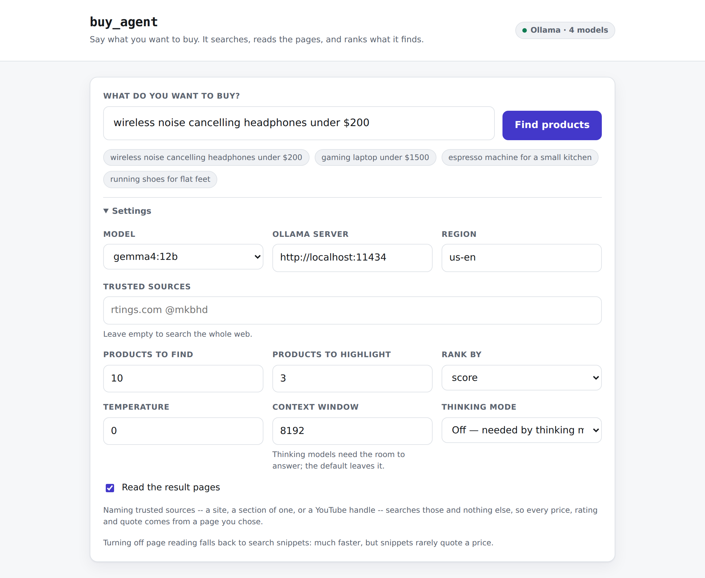

# buy_agent

A shopping agent built on LangChain and a local [Ollama](https://ollama.com) model.
Tell it what you want to buy; it searches the web, pulls out up to 10 products
along with what the pages say about them, ranks them, and logs the best 3.

```
$ python -m buy_agent "wireless noise cancelling headphones under $200"

18:12:17 INFO  buy_agent.agent  | Refined search query: wireless noise cancelling headphones under $200 price review
18:12:19 INFO  buy_agent.search | Search returned 10 results
18:12:19 INFO  buy_agent.fetch  | Fetching 10 result page(s)
18:12:20 INFO  buy_agent.fetch  | Got usable page text from 10 of 10 result(s)
18:13:24 INFO  buy_agent.agent  | Extracted 9 candidate(s)
18:13:24 INFO  buy_agent.verif. | Dropped unsupported figures on 4 product(s)
18:13:24 INFO  buy_agent        | ==============================================================
18:13:24 INFO  buy_agent        | TOP 3 OF 9 PRODUCTS
18:13:24 INFO  buy_agent        | ==============================================================
18:13:24 INFO  buy_agent        | #1  Bose ANC
18:13:24 INFO  buy_agent        |      score  : 0.967
18:13:24 INFO  buy_agent        |      price  : 152.00
18:13:24 INFO  buy_agent        |      rating : 4.7/5 (5,874 reviews)
18:13:24 INFO  buy_agent        |      url    : https://...
18:13:24 INFO  buy_agent        |      says   : the noise cancelling is uncanny for the money
18:13:24 INFO  buy_agent        |      says   : the case is too bulky for a coat pocket
```

[Architecture](docs/architecture.md) draws the whole of it as C4 diagrams --
context, containers, the components inside the pipeline and inside the web tier,
and one streamed run end to end. [How it works](#how-it-works) below is the same
story in prose.

## Setup

Everything runs locally; no API keys, no accounts.

```powershell
# 1. Ollama, with a model pulled
ollama serve
ollama pull gemma4:12b

# 2. Python environment
python -m venv .venv
.venv\Scripts\Activate.ps1
pip install -r requirements-dev.txt
```

To run the web UI without setting up either toolchain, build the image instead --
see [Running in Docker](docs/docker.md). Ollama still runs on the host.

A pulled tag follows the registry, and `python -m scripts.update_ollama` re-pulls
the models Ollama has and reports which builds actually moved -- see
[Keeping the models current](docs/models.md).

## Usage

```powershell
python -m buy_agent "gaming laptop under 5000 PLN" --region pl-pl
python -m buy_agent "espresso machine" --model qwen2.5 --results 15 --top 5
python -m buy_agent "running shoes" --sort-by price --json results.json
python -m buy_agent "wireless earbuds" --source rtings.com --source @mkbhd
```

| Flag | Default | Meaning |
| --- | --- | --- |
| `--model` | `gemma4:12b` (or `$OLLAMA_MODEL`) | Ollama model tag |
| `--base-url` | `http://localhost:11434` (or `$OLLAMA_HOST`) | Ollama server |
| `--results` | `10` | How many products to find |
| `--top` | `3` | How many to log |
| `--sort-by` | `score` | `score`, `price` or `rating` |
| `--region` | `us-en` | Search region, e.g. `uk-en`, `pl-pl` |
| `--source` | -- | Take the facts from this source only; repeatable |
| `--temperature` | `0.0` | Model temperature; extraction is a copying task |
| `--num-ctx` | `8192` | Context window in tokens |
| `--think` / `--no-think` | `--no-think` | Force thinking mode on or off |
| `--no-fetch` | off | Use search snippets only, without opening the result pages |
| `--json` | -- | Also write every result to a JSON file |
| `-v` | off | Debug logging |

### Thinking models

The default is one, so the two settings a thinking model needs are the defaults
too: thinking off, and an 8192-token window. Left to itself such a model fails.
The extraction prompt runs to roughly 4.3k tokens, so inside Ollama's own
4096-token window the model spends what is left thinking, gets cut off before it
writes any JSON, and the run ends with `Invalid json output:` and nothing after
the colon. The wider window is also what gets you the full ten products rather
than five.

That is why `--no-think` and `--num-ctx 8192` are no longer worth typing --
`qwen3.5`, `gemma4`, `lfm2.5`, anything listing the `thinking` capability, is
already covered. A model that cannot think ignores both, so switching to one
costs nothing; only a model you specifically want to hear reasoning from wants
the flags back:

```powershell
python -m buy_agent "wireless headphones under $200" --model qwen3.5:9b --think
```

As a library:

```python
from buy_agent import AgentConfig, BuyAgent

agent = BuyAgent(AgentConfig(model="gemma4:12b", top_n=3))
ranked = agent.run("noise cancelling headphones under $200")   # logs the top 3
print(ranked[0].product.name, ranked[0].score)                 # returns all of them
```

### Sources you trust

By default the facts come from whatever ten pages the search returned, which for
most shopping queries means affiliate roundups. `--source` says where they should
come from instead -- a review site, a section of one, or a YouTube channel by its
handle -- and the search then goes to those and nowhere else:

```powershell
python -m buy_agent "wireless earbuds under $150" --source rtings.com
python -m buy_agent "gaming laptop" --source @mkbhd --source notebookcheck.net
python -m buy_agent "espresso machine" --source https://www.seriouseats.com/coffee
```

Because the pages a run reads are the same pages every figure and every quote is
checked against, narrowing them narrows the report: everything in it was printed
by a page you named. Nothing falls back to the wider web, so naming sources that
have nothing to say about the request is a run that finds nothing -- which is the
answer, and the report says so rather than quietly going elsewhere.

Each source is searched separately (`site:` takes one domain at a time), and the
number of pages the run reads stays what `--results` asked for rather than
multiplying by the number of sources. What is enforced is the **domain**: a
result from another host is discarded before the model sees it. A handle or a
section narrows the search but cannot be enforced, because a video's address
says which video it is and not who published it -- see
[ADR-0027](docs/adr/0027-let-the-shopper-name-the-sources.md) for why that is
the strongest rule the URLs support.

The web UI has the same setting, as **Trusted sources** under Settings: one
field, separated by spaces or commas.

## The web UI

The same agent, with a page in front of it. `buy_agent.server` serves a small
JSON API and the built Angular app in `ui/`. Three ways to run it: the script
below, the same three steps by hand, or [the container](docs/docker.md), which
needs neither toolchain.

### Starting it on localhost

Two things run and one gets built: Ollama with a model pulled, the Angular
build, and the server that serves that build alongside the API.

`scripts/start.ps1` does all three and takes no arguments:

```powershell
.\scripts\start.ps1
```

It creates `.venv` and installs `requirements.txt` if they are not there, starts
Ollama if nothing is answering on it, pulls the default model if it is not
pulled, builds `ui/` if there is no build, then runs the server in the
foreground and opens the page. Each step is skipped when it is already done, so
a second run is a few seconds. Ctrl+C stops the server -- and the Ollama too, if
the script was what started it. It has no options on purpose: the model and the
Ollama server are `$env:OLLAMA_MODEL` and `$env:OLLAMA_HOST` like everywhere
else, and anything past that is a flag on the server itself, which is what the
manual route below is for.

Node is the one thing it will not install: without `npm` on PATH it says so and
serves the API anyway, so the page is the 503 until a build exists. A PowerShell
that refuses to run an unsigned script takes the same file the long way round:

```powershell
powershell -ExecutionPolicy Bypass -File .\scripts\start.ps1
```

By hand, the same three things:

```powershell
# 1. Ollama, in its own terminal -- skip it if Ollama already runs as a service
ollama serve
ollama pull gemma4:12b             # once; pulled tags are what the Model dropdown lists

# 2. The UI, built once -- and again after any change under ui/src
cd ui
npm install
npm run build                      # writes ui/dist/ui/browser
cd ..

# 3. The server, in a second terminal
.venv\Scripts\Activate.ps1
python -m buy_agent.server         # http://127.0.0.1:8000
```

Then open <http://127.0.0.1:8000> and search. Skip step 2 and the API still
answers, but the page is a 503 telling you to build it; `--ui-dir` points at a
build kept somewhere else, and `--host` / `--port` move the binding, which is
loopback on port 8000 by default. Ollama need not be local either --
`$OLLAMA_HOST`, or the Ollama server field under Settings, points the run at
another machine. To work on the UI itself, run the Angular dev server instead of
building for every change -- see [The dev server](#the-dev-server) below.



Two runs of it are recorded in `demo/`, fifteen seconds and twenty-two:
`wwii-books-1944-45.mpg` and `laptops-under-1000.mpg`, the second ending on the
shop page behind the top product's link. Everything between the search and the
ranking is the real pipeline -- only DuckDuckGo, the page fetches and the model
are scripted stand-ins -- so the progress panel is showing grounding actually
throwing figures, quotes and links away. [demo/README.md](demo/README.md) says
what is real in them, what is not, and how to record them -- and the picture
above -- again.

The page takes the same settings the CLI takes as flags, shows the agent's log
lines as the run happens, and lists the ranked products with a link to the page
each was found on. It binds loopback by default: it drives a model on your own
machine, and is not meant to be exposed.

Loopback keeps it off the network but not out of the browser, where any page you
have open can send requests to `127.0.0.1`. So the server answers its own page
and nothing else: a request a page on another site made is refused, as is one
addressed to a name that merely resolves here -- which is what a rebinding attack
looks like from this end. Clients that are not browsers send none of the headers
that decide this and are unaffected, so the `curl` below still works. Reaching
the server by some other name -- a container published on a LAN -- means naming
that name, with `--allowed-host buy.lan`, or it is refused too. See
[ADR-0018](docs/adr/0018-guard-the-loopback-server-against-other-pages.md).

Under Settings, **Model** is a dropdown of what that Ollama has actually pulled --
the same list `ollama list` prints, asked for over its API through
`GET /api/models`. Point the Ollama server field somewhere else and the list is
fetched again from there. A model that is configured but not pulled stays in the
dropdown marked `not pulled`, so a stale setting is visible rather than silently
swapped; a server that answered with nothing at all turns the field back into a
text box, so a name can still be typed.

When a run ends badly, the Progress panel offers **Download log**: the lines it
was showing, plus the error that ended the run, saved as
`buy-agent-log-20260825-140311.txt`. The panel scrolls and the next search clears
it, so without this a failure worth reporting is gone as soon as it is retried.

A search takes tens of seconds, so the browser does not wait on one response.
`GET /api/search/stream` runs the search and relays the agent's own log lines as
Server-Sent Events, finishing on a `result` or a `failure`. `POST /api/search`
does the same run in one JSON response, which is the shape a script wants:

```powershell
curl -X POST http://127.0.0.1:8000/api/search `
  -H "Content-Type: application/json" `
  -d '{"request": "espresso machine", "top": 5, "sort_by": "price"}'
```

| Endpoint | Answers with |
| --- | --- |
| `GET /api/config` | The form's defaults -- the same ones `--help` prints |
| `GET /api/models` | Which models Ollama has pulled, or why it could not be asked |
| `POST /api/search` | One run, as JSON |
| `GET /api/search/stream` | One run, as an event stream |

### The dev server

Working on the UI itself is nicer through the Angular dev server, which rebuilds
on save and proxies `/api` to the Python one:

```powershell
python -m buy_agent.server         # in one terminal
cd ui; npm start                   # in another -- http://localhost:4200
```

See `ui/README.md` for how the app is put together, and
[the web tier's components](docs/architecture.md#level-3----components-of-the-web-tier)
for how it sits behind the API.

## How it works

The C4 diagrams in [docs/architecture.md](docs/architecture.md) draw the same
thing, a zoom level at a time -- Mermaid, so GitHub renders them in place:

- [System context](docs/architecture.md#level-1----system-context) -- the
  shopper, the agent as one box, and the three things outside it: Ollama,
  DuckDuckGo and the shop pages.
- [Containers](docs/architecture.md#level-2----containers) -- the CLI, the web
  UI, the HTTP server, and the one pipeline both front ends drive.
- [Components of the agent pipeline](docs/architecture.md#level-3----components-of-the-agent-pipeline)
  -- the modules the pipeline below is made of, and what each of them decides.
- [Components of the web tier](docs/architecture.md#level-3----components-of-the-web-tier)
  -- the handler, the API and the Angular components in front of them.
- [A streamed run, end to end](docs/architecture.md#a-streamed-run-end-to-end)
  -- one search as a sequence diagram, from the request to the ranked cards.

For why it is this way, and what was tried and rejected, see the decision log in
[docs/adr/](docs/adr/README.md).

```
request ──▶ [LLM] refine into a search query
                      │
                      ▼
            DuckDuckGo text search (10 results)
              -- or one search per trusted source, pooled
                      │
                      ▼
     fetch each page, keep the lines quoting a figure or an opinion
                      │
                      ▼
        [LLM] extract structured products from that text
                      │
                      ▼
   clean names ▶ ground against sources ▶ merge duplicates ▶ rank ▶ log top 3
```

The control flow is fixed rather than left to the model to drive with tools. The
LLM does the two things it is good at -- rewording a request and reading facts out
of prose -- and ordinary Python does the rest. Small local models are unreliable
at running a tool loop, but perfectly capable of these two steps.

Seven details make it work with a small model:

- **Structured output.** Both LLM calls use Ollama's `json_schema` mode, so the
  model's decoding is constrained to the schema and cannot drift into prose.
- **Sentinels instead of nulls.** The extraction schema asks for `-1` rather than
  `null` for an unknown price (`buy_agent/models.py`). A required `number` makes
  it structurally impossible to answer `"N/A"` and fail validation for the whole
  batch. `ExtractedProduct.to_product()` turns the sentinels back into `None`.
- **Reading the pages, not the snippets.** A DuckDuckGo snippet for "headphones
  under $200" contains exactly one number: the $200 from the query. Extracting
  from snippets alone produced ten products with no prices at all. So each result
  page is fetched and condensed (`buy_agent/fetch.py`), which keeps the prompt
  small and gives the model something real to read. `--no-fetch` reverts to
  snippets only.
- **Reading the opinions too, not only the figures.** A page is swept twice: for
  the lines quoting a price or a rating, and for the lines passing judgement --
  "reviewers found", "the downside is", "disappointing". Each sweep has a budget
  of its own, so a shop page listing forty prices still contributes a verdict and
  a review page of prose still contributes its price. A price says what a thing
  costs and only these lines say whether to want it (ADR-0024).
- **Sources you can name.** Left alone the agent searches the whole web and
  the report is only as good as what ranked. `--source rtings.com --source
  @mkbhd` searches those instead, and since the pages a run reads are the pages
  every fact is checked against, that makes provenance a property of the
  pipeline rather than a promise: nothing in the report was printed anywhere but
  a page the shopper chose (ADR-0027).
- **Grounding.** Models fill gaps -- inventing a price, or lifting a product
  straight out of the prompt's own example. `buy_agent/verification.py` drops any
  product whose name is absent from the sources, and blanks any price, rating or
  review count that does not appear in the text the model was shown. A blanked
  figure scores neutral instead of winning.
- **Quotes, checked as quotes.** The opinions in the report are the source
  pages' words, not the model's summary of them, and each one is looked for in
  the sources as running text -- overlapping runs of five consecutive words, most
  of which have to be found. A paraphrase fails that and is dropped: an invented
  price is a number nobody wrote, but an invented quote is words in a reviewer's
  mouth.

### Ranking

`rank_products` scores each product in `[0, 1]`:

| Criterion | Weight | Notes |
| --- | --- | --- |
| Rating | 0.5 | `rating / 5` |
| Popularity | 0.2 | `log10(reviews)`, saturating at 1,000 reviews |
| Price | 0.3 | Relative to the other candidates: cheapest 1.0, dearest 0.0 |

A missing criterion scores 0.5 rather than 0, so a listing that simply did not
publish a rating is not buried beneath one that published a bad one. Adjust the
mix through `AgentConfig(weights=RankingWeights(rating=0.7, price=0.3, ...))`.

## Tests

```powershell
python -m pytest              # the Python suite
cd ui; npm test               # the UI's own tests, in jsdom
python -m pytest integration  # ...and against a real model, if one is pulled
```

Neither suite touches the network or Ollama, both run on Windows and on Linux,
and both are measured against a coverage floor CI enforces. The third, in
`integration/`, is the deliberate exception: it runs the pipeline against a real
Ollama on a model small enough for a CPU, which is the only place the claims
about JSON-schema decoding and about Ollama's transport errors are actually put
to Ollama. It lives outside `testpaths`, so `python -m pytest` cannot reach it,
and a nightly job capped at five minutes is what runs it (ADR-0026).

What the counts are, what `tests/test_conventions.py` checks that coverage
cannot, and the mutation run that grades the suite itself every Saturday are in
[Tests](docs/testing.md).

## Limitations

- **A figure can be real but attached to the wrong product.** Grounding checks
  that a number appears in the sources, not that it belongs to the product it
  was filed under, and small models sometimes give two products the same review
  count. Reading the top 3 as candidates worth clicking, rather than as a price
  quote, is the right level of trust.
- **A quote is tied to a page, not to a product on it.** A quoted opinion has to
  appear on a page that names the product (ADR-0025), so a verdict cannot move
  between pages about unrelated things -- but a review page covering eight
  headphones names all eight, and nothing stops a verdict moving between them.
- **A named source is a domain, not an author.** `--source @mkbhd` searches
  YouTube for that handle and keeps the YouTube pages that come back; a video by
  somebody else that mentions the handle can get through. The report links to
  the page, so whose it is can be seen.
- **Names are only as specific as the model makes them.** `lfm2.5` reported
  "Bose ANC" for a product the page named in full.
- Some shops answer with JavaScript-rendered pages or a 403; those results fall
  back to their snippet rather than failing the run.
- DuckDuckGo rate-limits heavy use; the agent reports this as a `SearchError`.
- Only `lfm2.5` (1.2B) has been measured: it works, takes ~75s end to end, and
  most of that is extraction. The failure modes above are the ones a small model
  shows, so a larger model should improve on them, but that is an expectation
  rather than something benchmarked here.
