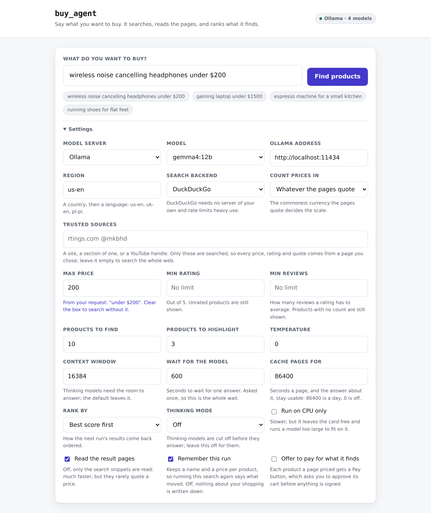
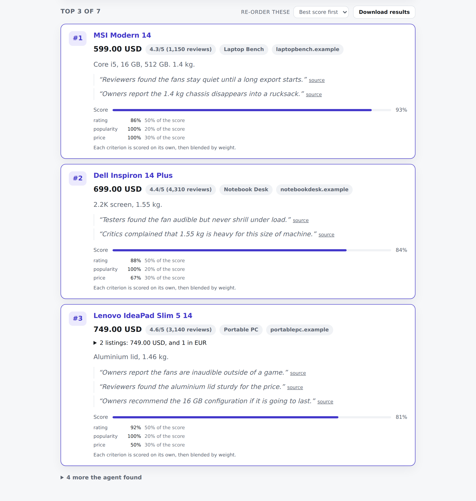
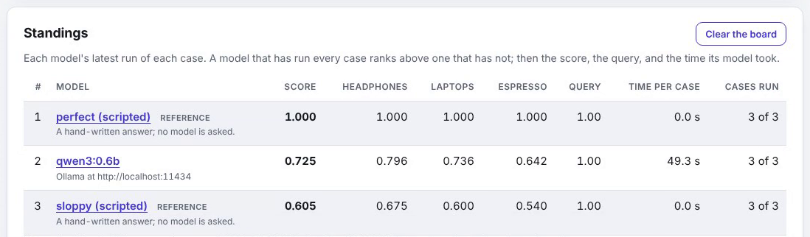

# buy_agent

A shopping agent built on a local model, served by [Ollama](https://ollama.com),
a [vLLM](https://docs.vllm.ai) or
[TensorRT-LLM](https://nvidia.github.io/TensorRT-LLM/) you already run, or
whatever a [LiteLLM](https://docs.litellm.ai) proxy of yours routes to. Tell it what you
want to buy; it searches the web, pulls out up to 10 products with what the
pages say about them, ranks them, and logs the best 3.





Three runs of that page are recorded in `demo/`:
[`wwii-books-1944-45.mpg`](demo/wwii-books-1944-45.mpg),
[`wwii-books-1944-45-with-sound.mpg`](demo/wwii-books-1944-45-with-sound.mpg)
(each log line where the pipeline catches the model out gets a note) and
[`laptops-under-1000.mpg`](demo/laptops-under-1000.mpg). They are MPEG program
streams, which browsers download rather than play. A fourth,
[`benchmark-on-cpu.mp4`](demo/benchmark-on-cpu.mp4), records
[the benchmark](#the-benchmark)'s page scoring a real model on a CPU, and is an
MP4, which browsers do play.

```
$ python -m buy_agent "wireless noise cancelling headphones under $200"

18:12:17 INFO  buy_agent.agent  | Refined search query: wireless noise cancelling headphones under $200 price review
18:12:19 INFO  buy_agent.search | Search returned 10 results
18:12:19 INFO  buy_agent.fetch  | Fetching 10 result page(s)
18:12:20 INFO  buy_agent.fetch  | Got usable page text from 10 of 10 result(s)
18:13:24 INFO  buy_agent.agent  | Extracted 9 candidate(s)
18:13:24 INFO  buy_agent.verif. | Dropped unsupported figures on 4 product(s)
==============================================================
TOP 3 OF 9 PRODUCTS, BEST SCORE FIRST
==============================================================
#1  Bose ANC
     score  : 0.967
     price  : 152.00
     rating : 4.7/5 (5,874 reviews)
     url    : https://...
     says   : the noise cancelling is uncanny for the money
     says   : the case is too bulky for a coat pocket
```

[docs/architecture.md](docs/architecture.md) draws it as C4 diagrams,
[How it works](#how-it-works) tells it in prose, and
[docs/adr/](docs/adr/README.md) says why it is this way.

## Setup

Everything runs locally; no API keys, no accounts. Python 3.14 and, for the web
UI, Node 24.21.0 or later.

```powershell
# 1. Ollama, with a model pulled
ollama serve
ollama pull gemma4:12b

# 2. Python environment
python -m venv .venv
.venv\Scripts\Activate.ps1
pip install -r requirements-dev.txt

# 3. Optional: only if you want it to pay for things (see "Letting it buy")
pip install -r requirements-ap2-deps.txt
pip install --no-deps -r requirements-ap2.txt

# 4. Optional: a picture of each result's page in the web UI
pip install -r requirements-screenshots.txt
python -m playwright install --only-shell chromium
```

`--no-deps` is deliberate: the AP2 SDK's metadata pins versions this project
does not use, so its real requirements are pinned in the first file.

To work on it, one script sets up everything the gate needs (the AP2 SDK
included, or the payment tests skip and the coverage floor is out of reach) and
another runs the gate
([ADR-0067](docs/adr/0067-script-the-contributor-setup-and-the-gate.md)):

```powershell
.\scripts\setup.ps1        # .venv, requirements-dev.txt, the AP2 SDK, npm ci in ui/
.\scripts\preflight.ps1    # the gate CI applies, both halves; -Only python|ui for one
```

`setup.ps1` also checks the Python and Node versions and whether the checkout
has CRLF line endings, which fail the UI's format check.

Alternatives: [Running against vLLM](#running-against-vllm) skips step 1;
[Running in Docker](docs/docker.md) needs neither toolchain; a published release
carries the built UI as an archive and a `ghcr.io` image
([ADR-0030](docs/adr/0030-publish-a-release-as-an-archive-and-an-image.md)).
`python -m scripts.update_ollama` re-pulls Ollama's models and reports which
moved ([docs/models.md](docs/models.md)).

## Usage

```powershell
python -m buy_agent "gaming laptop under 5000 PLN" --region pl-pl
python -m buy_agent "espresso machine" --model qwen2.5 --results 15 --top 5
python -m buy_agent "running shoes" --sort-by price --json results.json
python -m buy_agent "wireless earbuds" --source rtings.com --source @mkbhd
python -m buy_agent "headphones" --max-price 200 --min-rating 4.5 --min-reviews 500
python -m buy_agent "espresso machine" --compare          # ...and what moved since last time
python -m buy_agent "espresso machine" --alert-below 400  # exit 5 unless one is at or under 400
```

| Flag | Default | Meaning |
| --- | --- | --- |
| `--provider` | `ollama` (or `$BUY_AGENT_PROVIDER`) | `ollama`, `vllm`, `litellm` or `trtllm` |
| `--model` | the provider's own | Ollama tag, the name a vLLM or TensorRT-LLM was started with, or a LiteLLM alias |
| `--base-url` | the provider's own | Where that server listens |
| `--results` | `10` | How many products to find (1-50) |
| `--top` | `3` | How many to log (1-50) |
| `--sort-by` | `score` | `score`, `price` or `rating`; the report's heading names which |
| `--region` | `us-en` | Search region: a country, then a language -- `uk-en`, `pl-pl` |
| `--backend` | `ddg` (or `$BUY_AGENT_BACKEND`) | `ddg`, `searxng` or `brave` |
| `--currency` | the pages' own | Count this run's prices in this currency; nothing is converted |
| `--source` | -- | Take the facts from this source only; repeatable |
| `--max-price` | no limit | Report nothing dearer, in the run's currency |
| `--min-rating` | no limit | Report nothing rated below this, out of 5 |
| `--min-reviews` | no limit | Report nothing whose rating averages fewer reviews |
| `--alert-below` | no alert | Say whether anything in stock is at or under this price; removes nothing |
| `--cache-ttl` | `86400` | Seconds a page, and the model's answer about it, stay usable; `0` is off |
| `--journal` / `--no-journal` | `--journal` | Write this run down for the next run to compare against |
| `--compare` | off | Report what is cheaper, dearer, new or gone since the last run |
| `--temperature` | `0.0` | 0-2; above `0` answers vary, so they are never cached |
| `--num-ctx` | `16384` | Context window in tokens (Ollama only) |
| `--model-timeout` | `600` | Seconds to wait for one answer, which is asked once |
| `--think` / `--no-think` | `--no-think` | Force thinking mode on or off |
| `--cpu-only` / `--no-cpu-only` | `--no-cpu-only` | Keep the model off the GPU (Ollama only) |
| `--no-fetch` | off | Use search snippets only |
| `--json` | -- | Also write every result to a JSON file |
| `-v` | off | Debug logging |

The report goes to **stdout** and the timestamped progress to **stderr**, so
`> top.txt` keeps just the answer. Exit codes: `0` found products, `1` failed
(the reason is the last line on stderr), `2` usage error, `3` found nothing, `4`
asked to pay and did not, `5` an `--alert-below` nothing met, `130` Ctrl-C. `--json` is written either way.

As a library:

```python
from buy_agent import AgentConfig, BuyAgent

agent = BuyAgent(AgentConfig(model="gemma4:12b", top_n=3))
ranked = agent.run("noise cancelling headphones under $200")   # logs the top 3
print(ranked[0].product.name, ranked[0].score)                 # returns all of them
```

### Running against vLLM

```powershell
python -m buy_agent "gaming laptop under $1500" --provider vllm
python -m buy_agent "espresso machine" --provider vllm --base-url http://gpu.lan:8000/v1
$env:BUY_AGENT_PROVIDER = 'vllm'      # ...or once, for every run in this shell
```

`--provider` brings its own `--model` and `--base-url`: `$VLLM_MODEL` and
`$VLLM_HOST` (`Qwen/Qwen3-8B`, `http://localhost:8000/v1`), as `$OLLAMA_MODEL`
and `$OLLAMA_HOST` are Ollama's. Both servers constrain decoding to the JSON
schema, so the run is otherwise the same. The differences:

- **A vLLM serves one model, chosen when it started.** Asking for another is
  answered with what it is serving and how to restart it.
- **`--num-ctx` and `--cpu-only` are Ollama's**, so neither is sent and the form
  disables both. `--think` becomes `enable_thinking`.
- **A key, if there is one**, comes from `$env:VLLM_API_KEY` only -- no flag, so
  it stays out of shell history and out of what the API hands the browser.

See [ADR-0028](docs/adr/0028-serve-the-model-from-ollama-or-vllm.md) for why a
vLLM you run fits [ADR-0003](docs/adr/0003-local-ollama-no-api-keys.md).

### Running against a LiteLLM proxy

```powershell
python -m buy_agent "espresso machine" --provider litellm --model local_model
```

The defaults are `$LITELLM_MODEL` (`local_model`, a placeholder for an alias in
your proxy's `model_list`), `$LITELLM_HOST` (`http://localhost:4000/v1`) and
`$LITELLM_API_KEY`. The proxy is reached with the `openai` client, so the
LiteLLM SDK is not a dependency. `--num-ctx` and `--cpu-only` are not sent, and
`--think` becomes `reasoning_effort`. Whether a request leaves the machine is up
to the proxy's `config.yaml`
([ADR-0068](docs/adr/0068-reach-a-litellm-proxy-as-a-third-model-server.md)).

### Running against TensorRT-LLM

```powershell
python -m buy_agent "gaming laptop under $1500" --provider trtllm
```

`trtllm-serve` is reached the way a vLLM is: the same client, the same
`/v1/models` listing, and `--think` sent as `enable_thinking`. The defaults are
`$TRTLLM_MODEL` (`Qwen/Qwen3-8B`), `$TRTLLM_HOST` (`http://localhost:8000/v1`)
and `$TRTLLM_API_KEY`, which is for a gateway in front of it, since
`trtllm-serve` checks no key itself. It serves one model, and `--num-ctx` and
`--cpu-only` are not sent. It has to be started with guided decoding on, or the
JSON schema is not enforced:

```bash
echo 'guided_decoding_backend: xgrammar' > guided.yaml
trtllm-serve Qwen/Qwen3-8B --extra_llm_api_options guided.yaml
```

If it was started without that, the hint says so
([ADR-0081](docs/adr/0081-reach-tensorrt-llm-as-a-fourth-model-server.md)).

### Thinking models

The default model thinks, so thinking off and a 16384-token window are the
defaults too. The extraction prompt is about 4.3k tokens; inside Ollama's own
4096 the model thinks until it is cut off, and the run ends with
`Invalid json output:`. The wider window also fits the JSON for all ten products
(ADR-0050). Only a model you want to hear reasoning from needs the flag:

```powershell
python -m buy_agent "wireless headphones under $200" --model qwen3.5:9b --think
```

### Which model to use

[The benchmark](#the-benchmark) runs the models your server holds over three fixed
shopping cases -- headphones in dollars, a gaming laptop in the thousands, an
espresso machine in euros -- and ranks them on what they read off the pages, the
query they wrote and how long they took. It has a page of its own:

```powershell
python -m benchmark.server                       # then open http://127.0.0.1:8100
```

### Sources you trust

By default the facts come from whatever ten pages the search returned, usually
affiliate roundups. `--source` names a review site, a section of one, or a
YouTube handle, and the search goes there and nowhere else:

```powershell
python -m buy_agent "wireless earbuds under $150" --source rtings.com
python -m buy_agent "gaming laptop" --source @mkbhd --source notebookcheck.net
python -m buy_agent "espresso machine" --source https://www.seriouseats.com/coffee
```

Every figure and quote is checked against the pages read, so everything in the
report was printed by a source you named. Nothing falls back to the wider web.
Each source is searched separately and the pool is cut back to `--results`. The
**domain** is what is enforced; a handle or section only narrows the search
([ADR-0027](docs/adr/0027-let-the-shopper-name-the-sources.md)). In the browser
it is **Trusted sources** under Settings.

### Saying what you will actually buy

"under $200" in the request only shapes the search query. Three flags say it as
a number, and Python enforces them after duplicates are merged and before
ranking:

```powershell
python -m buy_agent "wireless headphones" --max-price 200
python -m buy_agent "espresso machine" --min-rating 4.5 --min-reviews 500
```

```
1 of 10 product(s) are within the limits (at most 200.00, rated at least 4.5)
```

- **A product whose figure the run never learned is kept**, because a blank is
  more often a page that printed none than a product that costs too much
  ([ADR-0039](docs/adr/0039-enforce-the-shoppers-bounds-in-python.md)).
- **Prices are compared inside one currency, and nothing is converted.** The
  run counts in the commonest currency its pages printed; a price in any other
  passes the budget, scores neutral and is marked "assumed"
  ([ADR-0043](docs/adr/0043-compare-prices-only-within-one-currency.md)).
- **`--currency` names that scale** instead of leaving it to the vote, and the
  budget is read in it: `--max-price 800 --currency PLN` means 800 złoty. A
  currency no page quotes gets a warning
  ([ADR-0056](docs/adr/0056-let-the-shopper-name-the-currency.md)).

The bounds are never read out of the request and applied: "200 hours of battery"
would drop every product. Instead the run notices a bound in the request and
offers it -- the CLI names the flag, and the browser pre-fills the box
([ADR-0059](docs/adr/0059-notice-a-bound-in-the-request-and-offer-it.md)).

### Letting it buy

Off by default, and impossible without the AP2 SDK. When on, the agent completes
the purchase, authorised by signed [AP2](https://ap2-protocol.org) mandates
rather than a card number:

```powershell
python -m buy_agent "wireless headphones under $200" --pay
```

```
  Pay 329.99 USD for Sony WH-1000XM5
    merchant  AudioSite
    page      https://audiosite.example/xm5
    rail      Dry run -- you will NOT be charged
  Type yes to authorise:
```

The prompt restates the **cart**, and a run with no terminal is refused rather
than assumed. **The default rail charges nobody**: it signs a real, verifiable
authorisation and stops. Paying for real means naming somewhere to pay:

```powershell
python -m buy_agent "headphones" --pay --rail http --merchant-url https://pay.example --spend-limit 250
```

No merchant is named anywhere in this project. The `http` rail asks
`{url}/checkout` for a signed checkout and presents the mandates at
`{url}/payment`; `python -m demo.merchant` is a local one that charges nobody
([demo/README.md](demo/README.md#a-merchant-for-the-http-rail)).
`--spend-limit` is a ceiling in the run's currency. Any of those flags without
`--pay` is named as idle.

**Only a product the sources priced can be bought**: a blanked price, an
unprinted currency, or a price outside the run's currency is refused -- the
opposite of the bounds, which keep what they cannot judge.

`$BUY_AGENT_AP2_KEY` points at an EC P-256 private key (`openssl ecparam -genkey
-name prime256v1 -noout -out agent-key.pem`); the dry run generates a throwaway
one. `$BUY_AGENT_AP2_MANDATE` names a pre-signed *open* mandate for buying while
you are not there; its constraints are checked before anything is sent
([ADR-0046](docs/adr/0046-pay-on-the-shoppers-behalf-with-ap2.md)). In the
browser, tick **Offer to pay for what it finds** and each card that can be bought
gets a Pay button that asks twice.

### Running the same search twice is nearly free

Fetched page text and the model's answer are kept on disk for a day, so
re-running to change a bound, a weight or the sort order takes seconds and asks
the shops nothing.

```powershell
python -m buy_agent "headphones" --cache-ttl 0      # every page and answer fresh
$env:BUY_AGENT_CACHE_DIR = "D:\scratch\buy-agent" # somewhere else
```

The page *text* is stored, not the excerpt, so a cached run extracts from what a
fresh one would. Only pages that were read are stored, and every cache failure is
a miss, never a failed run
([ADR-0040](docs/adr/0040-cache-the-page-text-on-disk.md)). Each kind is capped
at 256 MB, oldest out first
([ADR-0052](docs/adr/0052-cap-the-cache-by-size-as-well-as-age.md)). An answer
is keyed on the whole question -- prompt, pages, schema, model, server and
settings -- and a run above temperature 0 is never remembered
([ADR-0044](docs/adr/0044-remember-a-deterministic-model-answer.md)). A day-old
entry is a day-old price; `--cache-ttl 0` when figures must be live.

### ...and it says what moved

`runs/`, beside the cache, keeps a name, price and currency per product for each
search:

```powershell
python -m buy_agent "espresso machine" --compare
```

```
==============================================================
WHAT CHANGED SINCE 11 SEP
==============================================================
  Sage Bambino Plus                329.00 USD, 20.00 USD cheaper than on 11 Sep.
  Gaggia Classic Evo Pro           449.00 USD, unchanged since 11 Sep.
  Breville Barista Express         699.00 USD, and not in the run of 11 Sep.
  De'Longhi Dedica                 Reported at 199.00 USD on 11 Sep, and not in
                                   this run.
==============================================================
```

It never expires and is bounded by count: ten runs per search, two hundred
searches, least recently run out first. A search is the request plus what shaped
it (region, scale, sources, bounds), never the model
([ADR-0060](docs/adr/0060-keep-a-run-journal-beside-the-cache-not-in-it.md)).
`--no-journal` writes nothing. The browser shows the same comparison under the
results.

### ...and whether the price you are waiting for has arrived

`--alert-below` (the form's **Price alert**) says whether anything found is at or
under a price, and removes nothing:

```powershell
python -m buy_agent "espresso machine" --alert-below 400 --top 1 && notify-me
```

```
PRICE ALERT MET: At or under 400.00 USD: Sage Bambino Plus at 329.00 USD.
```

Unlike `--max-price`, which keeps a product whose price nobody printed, only a
price this run can place meets it, and never one whose page says it is out of
stock. When nothing does, the run exits `5` and names the cheapest, so a scheduled
run is a price watch with the journal as its history
([ADR-0080](docs/adr/0080-tell-the-shopper-whether-a-price-alert-was-met.md)).

### What each page priced it at

Every grounded listing is kept as an **offer** -- price, currency, shop and page
-- and merging keeps all of them. The card says **3 listings, 129.00-149.00 USD**
and the CLI adds an `offers` line. Ranking, bounds and the currency vote still
read one headline price; the cart is built from the listing that price came off,
so it names the shop that quoted it
([ADR-0058](docs/adr/0058-keep-every-listing-a-product-was-priced-at.md)).

A listing also says whether it is **in stock** and whether it is **new, used or
refurbished**, where a page about it says so: a `state` line on the CLI, a pill on
the card. Both are grounded with the price and dropped with it, a cheap
refurbished pair says so wherever its price is shown, and a listing its page marks
out of stock is never paid for
([ADR-0079](docs/adr/0079-ground-a-listings-stock-and-condition-with-its-price.md)).

### What the pages say

Each product carries up to three quotes: `says` lines on the CLI, quoted lines on
each card, `opinions` in the JSON. Each page is swept twice, on separate budgets:
for lines quoting a figure and for lines passing judgement, judged by a
vocabulary of verdicts ("reviewers found", "the downside is"), never of subject
matter ([ADR-0024](docs/adr/0024-read-and-quote-what-the-sources-say.md)).

A quote must appear as running text -- most of its overlapping five-word runs --
on a page that names the product, or it is dropped
([ADR-0025](docs/adr/0025-check-a-quote-against-the-page-it-came-from.md)). Each
quote links the page that printed it
([ADR-0042](docs/adr/0042-keep-the-page-a-quote-came-from.md)). Quotes are not
scored.

### Why the report is as short as it is

Five steps take a whole candidate out: a headline reported as a product, a name
no searched page mentions, a name that identifies nothing, a duplicate merged
into another, and anything outside your bounds. The CLI logs a count per step
(names under `-v`); the browser lists each under the results with Python's reason:

```
The 5 best kettles of 2026   Reads as an article or a shop, not a product.
Bonavita Gooseneck Kettle    No page that was searched mentions it.
Fellow Stagg EKG Pro         Outside the limits you set (at most 100.00 USD).
```

([ADR-0055](docs/adr/0055-report-what-a-run-took-out.md)). Steps that only
*blank* a price, quote or link leave the product on its own card.

## The web UI

`buy_agent.server` serves a JSON API and the Angular app built from `ui/`.

### Starting it on localhost

```powershell
.\scripts\start.ps1
```

It creates `.venv`, installs `requirements.txt`, starts Ollama, pulls the default
model and builds `ui/` where each is not already done, then serves and opens the
page. Ctrl+C stops the server, and Ollama if it started it. It takes no
arguments: the provider, model and address come from `$env:BUY_AGENT_PROVIDER`,
`$env:OLLAMA_MODEL`/`$env:OLLAMA_HOST` (or the `VLLM_`/`LITELLM_`/`TRTLLM_`
pairs). It starts only Ollama; for the others it waits for the server you run. Without
`npm` it serves the API and a 503 page. It installs the AP2 SDK only when
`$env:BUY_AGENT_RAIL`, `$env:BUY_AGENT_MERCHANT_URL`, `$env:BUY_AGENT_AP2_KEY` or
`$env:BUY_AGENT_AP2_MANDATE` is set. Under a restrictive execution policy, run
`powershell -ExecutionPolicy Bypass -File .\scripts\start.ps1`.

By hand:

```powershell
# 1. Ollama, in its own terminal -- skip it if Ollama already runs as a service
ollama serve
ollama pull gemma4:12b

# 2. The UI, built once -- and again after any change under ui/src
cd ui; npm install; npm run build; cd ..

# 3. The server
.venv\Scripts\Activate.ps1
python -m buy_agent.server         # http://127.0.0.1:8000
```

Without step 2 the page is a 503 saying how to build it. `--ui-dir` points at a
build elsewhere; `--host`/`--port` move the loopback binding. vLLM also defaults
to port 8000, so give one of them another port. The recordings at the top are of
this page with only the search, fetches and model scripted
([demo/README.md](demo/README.md)).

The server answers its own page and nothing else: a cross-site request, a
foreign `Origin` or a `Host` that merely resolves here is refused. `curl` still
works; another name needs `--allowed-host buy.lan`
([ADR-0018](docs/adr/0018-guard-the-loopback-server-against-other-pages.md)).

Under Settings, **Model server** picks Ollama, vLLM or LiteLLM, and **Model**
lists what that server is serving, marking a configured model `not served` and
one that cannot chat `embedding only`
([ADR-0032](docs/adr/0032-say-which-models-can-answer-a-prompt.md)). A value the
server would refuse is refused on the page first, on the server's own ranges
([ADR-0033](docs/adr/0033-let-the-form-refuse-what-the-server-would.md)). A
failed or stopped run offers **Download log**. A finished one offers **Re-order
these**, which re-ranks without re-running
([ADR-0035](docs/adr/0035-re-sort-a-finished-run-without-running-it-again.md)),
and **Download results**, the same document `--json` writes.

### A picture of each page

With [Playwright](https://playwright.dev/python/) installed (step 4 of
[Setup](#setup)), each card shows a picture of the page it links to, taken by one
headless browser the server launches on demand and closes after a minute idle.
Only a server bound to this machine takes pictures, since a browser on the
network would photograph a router's page for anyone who asked
([ADR-0065](docs/adr/0065-photograph-each-products-page-from-a-server-bound-to-this-machine.md)).

### The API

`GET /api/search/stream` relays a run's log lines as Server-Sent Events, ending
on `result` or `failure`. `POST /api/search` is the same run as one JSON reply:

```powershell
curl -X POST http://127.0.0.1:8000/api/search `
  -H "Content-Type: application/json" `
  -d '{"request": "espresso machine", "top": 5, "sort_by": "price"}'
```

| Endpoint | Answers with |
| --- | --- |
| `GET /api/config` | The form's defaults -- the same ones `--help` prints |
| `GET /api/models` | What a named server is serving, or why it could not be asked |
| `GET /api/sources` | Whether a Trusted sources field names sites |
| `GET /api/bounds` | What the request itself asks for, offered and never applied |
| `GET /api/screenshot` | A JPEG of the page at `url`, where the server takes pictures |
| `POST /api/search` | One run, as JSON |
| `POST /api/rank` | A finished run's products in another order |
| `POST /api/pay` | One of those products bought, given the approval the page witnessed |
| `GET /api/search/stream` | One run, as an event stream |

### The dev server

```powershell
python -m buy_agent.server         # in one terminal
cd ui; npm start                   # in another -- http://localhost:4200
```

It rebuilds on save and proxies `/api`. See `ui/README.md` and
[the web tier's components](docs/architecture.md#level-3----components-of-the-web-tier).

## How it works

```
request ──▶ [LLM] refine into a search query
                      │
                      ▼
            one text search, through whatever backend was named (10 results)
              -- or one search per trusted source, pooled
                      │
                      ▼
     fetch each page (or read yesterday's), keep the lines
     quoting a figure or an opinion
                      │
                      ▼
        [LLM] extract structured products from that text
                      │
                      ▼
   clean names ▶ ground against sources ▶ merge duplicates
                      │
                      ▼
   hold to the bounds you set ▶ rank ▶ log top 3
```

The control flow is fixed rather than a tool loop. The LLM does the two things
small models are reliable at -- rewording a request and reading facts out of
prose -- and Python does the rest (ADR-0002). What makes that work:

- **Structured output.** Both calls use JSON-schema mode, so decoding cannot
  drift into prose.
- **Sentinels instead of nulls.** The schema asks for `-1` rather than `null`
  for an unknown price, so `"N/A"` is impossible (`buy_agent/models.py`).
- **Reading the pages, not the snippets.** A snippet for "headphones under $200"
  holds one number: the $200. Each page is fetched and condensed
  (`buy_agent/fetch.py`).
- **Reading what a page declares.** Most shops describe their products to search
  engines in schema.org JSON-LD. That is written out as the lines a shop would
  print -- "Sony WH-1000XM5: 348.00 USD, in stock, condition: new" -- ahead of the
  page's text, so the model reads it and grounding checks it like any other line
  (`buy_agent/structured.py`,
  [ADR-0078](docs/adr/0078-read-what-a-page-declares-as-lines-it-prints.md)).
- **Grounding.** `buy_agent/verification.py` drops products whose name no source
  mentions and blanks any figure the text does not show. A blanked figure scores
  neutral instead of winning.
- **Quotes checked as quotes, and cited**, as above.
- **Bounds enforced in Python**, as above.

### Ranking

`rank_products` scores each product in `[0, 1]`:

| Criterion | Weight | Notes |
| --- | --- | --- |
| Rating | 0.5 | `rating / 5` |
| Popularity | 0.2 | `log10(reviews)`, saturating at 1,000 reviews |
| Price | 0.3 | Relative to the other candidates: cheapest 1.0, dearest 0.0 |

A missing criterion scores 0.5, not 0, so an unpublished rating is not buried
under a bad one. Change the mix with
`AgentConfig(weights=RankingWeights(rating=0.7, price=0.3, ...))`. Because 0.5 is
also an average score, each score reports its shares, their weights, and which
were assumed
([ADR-0041](docs/adr/0041-report-what-a-score-is-made-of.md),
[ADR-0045](docs/adr/0045-report-the-weights-a-score-was-blended-by.md)):

```
#1  Anker Soundcore Q30
     score  : 0.650  (rating 0.50 x0.50 assumed, popularity 0.50 x0.20 assumed, price 1.00 x0.30)
```

## The benchmark

Which local model should the agent use, and did a change to a prompt or a
threshold make it better? `benchmark/` answers both by scoring runs against
answer keys. It asks a model the two things a run asks of one -- turn the request
into a search query, then read the products, figures and quotes off the pages --
over three fixed shopping cases, through the real pipeline. Nothing touches the
web, so every model reads the same pages
([ADR-0036](docs/adr/0036-score-the-agent-against-a-fixed-answer-key.md),
[ADR-0070](docs/adr/0070-compare-local-models-and-give-the-comparison-a-page.md)).



That is a frame of [`demo/benchmark-on-cpu.mp4`](demo/benchmark-on-cpu.mp4): 4 min
7 s of the benchmark's page scoring a real `qwen3:0.6b` in Ollama on four Xeon
cores and no GPU, narrated and captioned. The recorder polls `ollama ps`
throughout and refuses to write a take in which any model had memory on a GPU
([demo/README.md](demo/README.md#the-benchmark-on-a-cpu)).

### Reading the standings

The cases are headphones priced in dollars, a gaming laptop priced in the
thousands and an espresso machine priced in euros, each set with what trips a
small model up: a headline or a shop posing as a product, one product under two
names, a monthly payment or a student price posing as the price, a listing in
Canadian dollars, decimal commas, cashback.

A case's score is made of eight shares, each in `[0, 1]`. Six come in pairs -- how
much was found, and how much of what was reported is right: the five slots filled
with products really on the pages (weighed 3) and entries that are real products,
not shops or repeats (2); prices, ratings and review counts printed for that product
(2) and figures that are not another's (2); products carrying a verdict their pages
passed on them, and quotes that are such a verdict word for word (1 each). A pair
counts by the weighted harmonic mean of its halves, so it is worth only as much as
the weaker one allows: reporting nothing earns nothing, and neither does reporting
nonsense. The other two are a link to a page about the product (1) and a ranking in
the key's own order (1), which counts only what it got right above the half of its
pairs a shuffle would. A share with nothing to count still shows on the scorecard,
where its floor reads it, and counts 0 in the score (ADR-0074).
**Query** is scored apart, as the share of checks the search query passed: each
constraint the request states kept, no brand and no figure the shopper did not
give, and twenty words or fewer.

A row's **Score** is the mean over its cases, a failed run counting 0, and
**Query** and **Time per case** are means too. Rows rank by how many cases they
ran, then the score, the query, and the time, quickest first. The two references
need no model, and bracket the ones that do: `perfect` is the answer key copied
out and scores 1.000, and `sloppy` makes the mistakes small models make -- a price
off another product's line, a headline and a shop reported as products, a quote
nobody wrote, one product twice.

### What the recorded run found

`qwen3:0.6b` (Q4_K_M, 397 MB, in Ollama 0.35.1, on 6 October 2026) scored 0.725,
between `sloppy`'s 0.605 and `perfect`'s 1.000, and the whole comparison took
2 min 29 s. An earlier take, on 3 October and scored before ADR-0074, gave the
same counts. Every query it wrote passed every check, and nothing in its reports was
invented or repeated. It lost points by reporting too little -- four or three
products for five slots, and not one quote -- and, on the euro case, by
misattributing two of nine figures and linking one product to a page not about it:

| Case | Score | Real products, of 5 | Figures right | Model time |
| --- | --- | --- | --- | --- |
| `headphones` | 0.796 | 4 | 12 of 12 | 1 min 02 s, loading the model included |
| `laptops` | 0.736 | 3 | 9 of 9 | 45.0 s |
| `espresso` | 0.642 | 3 | 7 of 9 | 40.8 s |

That is one model, once, on one machine; [Running it](#running-it) scores yours.

### Running it

```powershell
python -m benchmark.server                       # the page, on http://127.0.0.1:8100
python -m benchmark --all-models                 # every model the server holds, here
python -m benchmark --model qwen3:4b --model gemma4:12b --case espresso
python -m benchmark --scripted perfect           # no model at all: 1.000 by construction
python -m benchmark --baseline before.json       # what moved since an earlier --json
```

On the page, pick a model server and tick the models it lists (an embedding model
is shown but cannot be ticked), the references and the cases, then press **Run**.
Rows fill in as each run finishes, and a model's name opens what it did on each
case: the scorecard against its floors, the query and the checks it passed, how
long each question took, and every product it reported, tagged where it was
invented or repeated. One comparison runs at a time and outlives the tab; **Stop**
ends it at the next step. `python -m benchmark.server` binds this machine only,
and takes `--host`, `--port` and `--allowed-host` as the shop's server does
(ADR-0018).

`python -m benchmark` prints each run's scorecard and then the standings, and
exits 0 only when every run finished and cleared every floor:

| Flag | Default | Meaning |
| --- | --- | --- |
| `--model` | the provider's own, if nothing else is named | A model to score; repeatable |
| `--all-models` | off | Every model the server holds that can answer a prompt |
| `--scripted` | -- | `perfect` or `sloppy`, beside the models or instead of them |
| `--case` | all three | `headphones`, `laptops` or `espresso`; repeatable |
| `--provider` | `ollama` (or `$BUY_AGENT_PROVIDER`) | `ollama`, `vllm`, `litellm` or `trtllm` |
| `--base-url` | the provider's own | Where that server listens |
| `--json` | -- | Also write the standings, every run included, to this file |
| `--baseline` | -- | Compare each run, metric by metric, with its run in an earlier `--json` file |
| `--no-save` | off | Keep these runs off the board |
| `-v` | off | Each run's own progress log |

A model that cannot be asked at all -- not running, not pulled, too slow -- is
reported in its server's own words, and its other cases are skipped. One that
answers with something unreadable has failed that case, which counts 0.

Every run is kept on a board, `$BUY_AGENT_CACHE_DIR/benchmark/board.json`, which
the page and the command line both read, so a model pulled next week stands beside
this week's. A run scored against a case whose pages or key have changed since is
left out, and **Clear the board** forgets them all. Each run also records the code it
went through, its settings and its model's build: a row made under code or settings
this checkout no longer has is tagged **stale** and says which of its runs to make
again, and one whose runs span two builds of a tag says so (ADR-0075). The board keeps
only the latest run, so to ask whether a change helped, keep `--json` from before it
and give it to `--baseline` after. The nightly integration run
scores `qwen3:0.6b` on the headphones case alone, prints the scorecard on its summary
page and keeps it as the `scorecard` artifact, pass or fail (ADR-0072), and fails
under `benchmark.scoring.FLOORS`, a tripwire rather than a target (ADR-0026).
[docs/testing.md](docs/testing.md#the-benchmark) has the metrics one by one and
how the keys are kept honest.

## Tests

```powershell
.\scripts\preflight.ps1       # everything CI checks, in its order -- or one at a time:

python -m pytest              # the Python suite
python -m pylint buy_agent    # the linter
python -m mypy buy_agent      # the type checker
cd ui; npm test               # the UI's own tests, in jsdom
python -m pytest integration  # against a real model, if one is pulled

python -m benchmark --scripted perfect   # score the pipeline, no model needed
python -m benchmark                      # ...and score whatever is serving
python -m benchmark.server               # ...or compare several models on a page
```

Neither suite touches the network or a model server, and both have coverage
floors. `integration/` runs against a real Ollama on a CPU-sized model, nightly
with a five-minute cap (ADR-0026). `benchmark/` scores runs against fixed answer
keys over three cases ([above](#the-benchmark)). `tests/test_architecture.py`
holds the import graph
([ADR-0047](docs/adr/0047-check-the-import-graph-with-archunit.md)), and
`tests/test_conventions.py` the rules between modules.
[docs/testing.md](docs/testing.md) has the rest.

## Limitations

- **A figure can be real but attached to the wrong product.** Grounding checks
  that a number is in the sources, not whose it is. The benchmark's
  `attribution` metric measures this.
- **A quote is tied to a page, not a product on it.** A review of eight
  headphones names all eight. The quote's `source` link shows the page. The
  benchmark's `faithful` metric measures this.
- **A model number can be one off.** Grounding reads a name's words against a 0.6
  bar, so a model's "WH-1000XM4" survives pages about the XM5. The benchmark
  counts it as a product nobody wrote about.
- **A bound has to be typed.** It is noticed and offered, never applied.
- **Stock and condition are only what a page said**, and most pages say neither.
  An unknown standing is not refused at payment, and ranking reads neither.
  Microdata and RDFa declarations are not read, only JSON-LD.
- **A cached page or answer is as current as its age**, up to a day by default.
- **A named source is a domain, not an author.** `--source @mkbhd` keeps YouTube
  pages, including other people's.
- **Names are only as specific as the model makes them.** `lfm2.5` reported
  "Bose ANC" for a product the page named in full.
- **A mixed-currency search scores most of itself on nothing**, since prices are
  never converted (ADR-0043). `--currency` picks which one is scored.
- **Paying is only as good as the page it read**: the merchant is the site the
  product page came from. The prompt shows it before anything is signed.
- **No real money has moved through the `http` rail.** It has been driven against
  [`demo/merchant.py`](demo/README.md#a-merchant-for-the-http-rail) only. The
  two request shapes are this project's choice; the mandates are the standard's.
- A 429 or 503 is retried once after its `Retry-After` (capped at five seconds),
  a failed search after two (ADR-0053). The model is asked once, bounded by
  `--model-timeout` (ADR-0051).
- Pages that refuse or need JavaScript fall back to their snippet, and the run
  says how fetching went: "Got usable page text from 0 of 10 result(s): 7 refused
  (403), 2 timed out".
- DuckDuckGo rate-limits heavy use. `--backend searxng` (`$SEARXNG_HOST`) or
  `brave` (`$BRAVE_API_KEY`) are the way out
  ([ADR-0057](docs/adr/0057-a-search-backend-is-a-row-in-a-table.md)); only the
  default is exercised against the real thing.
- No model larger than the nightly's `qwen3:0.6b` is scored on a schedule;
  `python -m benchmark --all-models`, or [its page](#the-benchmark), is how to
  find out on yours.
