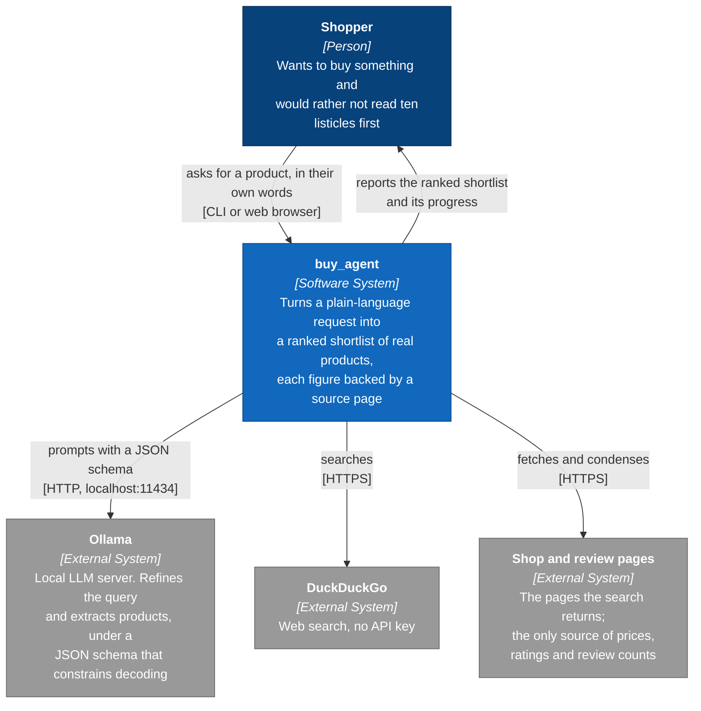
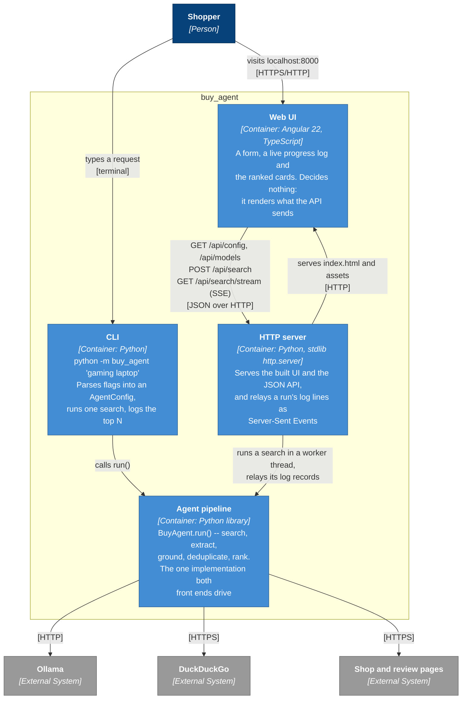
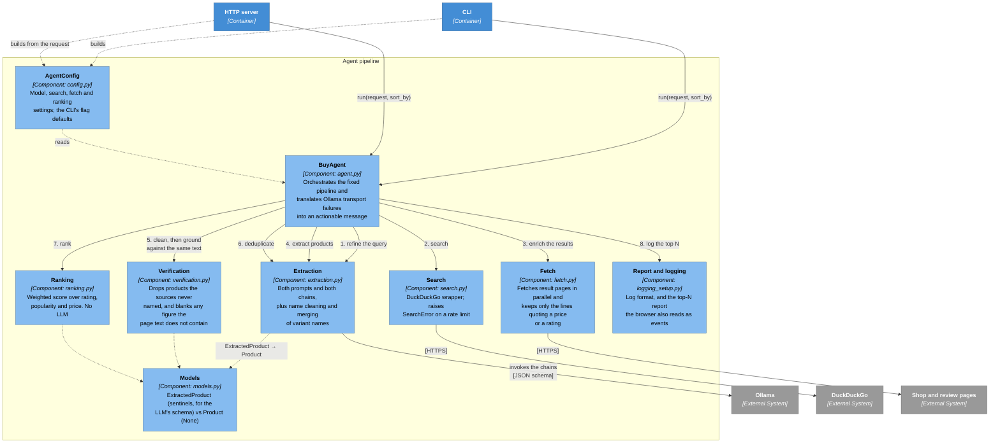
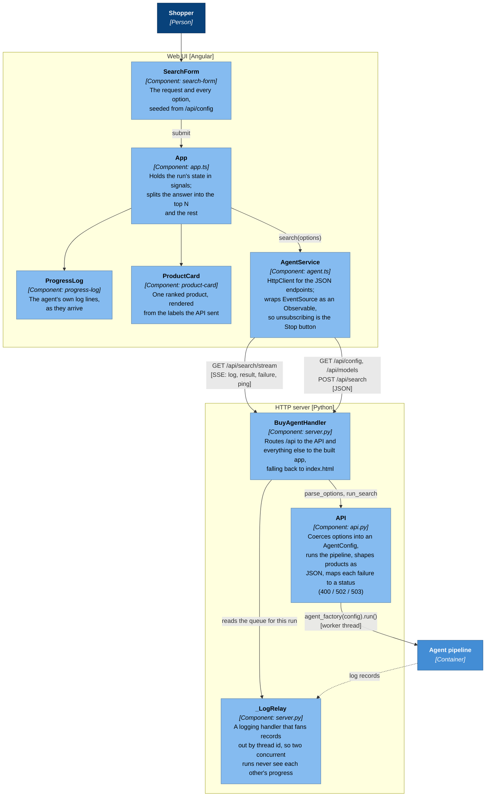
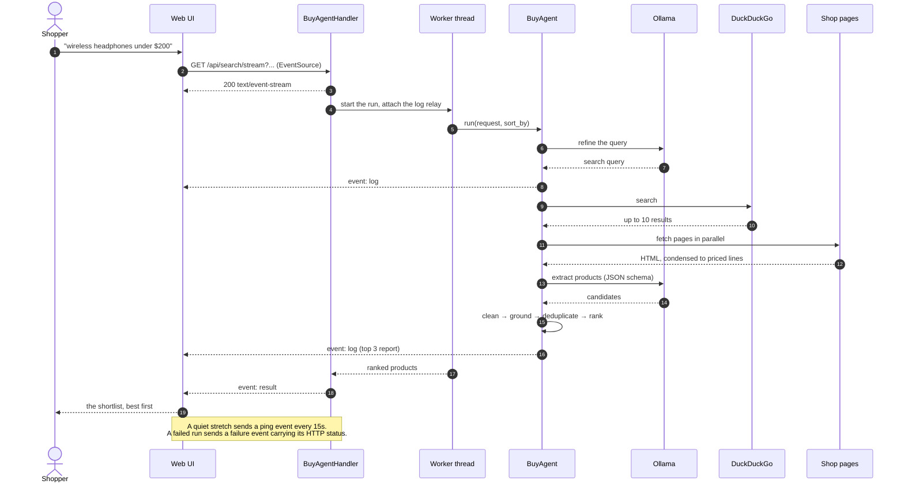

# Architecture (C4)

The [C4 model](https://c4model.com) at three zoom levels: who uses the system,
what it is made of, and how the pieces inside each part fit together. The
diagrams are Mermaid, so GitHub renders them in place.

The one idea worth carrying through all three levels: **the LLM is not in
charge.** It refines the query and reads products out of pages; every decision
that shapes the answer -- filtering, grounding, ranking, ordering -- is ordinary
Python. That is why the component diagram has one small box for the model and
several for the code around it.

## Level 1 -- System context

Everything runs on the shopper's own machine: no accounts, no API keys, and
nothing about a search leaves the laptop except the search itself and the page
fetches.

## Level 2 -- Containers

The CLI and the server are two front ends onto the same `BuyAgent.run()`. The
server is stdlib-only on purpose -- a run that takes a minute and serves one
person does not need a framework under it.

## Level 3 -- Components of the agent pipeline

Two joints in that order are load-bearing, and both are about not ranking a
number nobody wrote down:

- `clean_products` runs **before** `ground`, so a name still wearing its
  publisher suffix ("... Review | AudioSite") is not failed by a coverage check
  for tokens the page never had to contain.
- `ground` runs **before** `deduplicate`, so merging only ever combines figures
  the sources back.

Extraction and verification must be handed the *same* text, which is why
`fetch.enrich()` puts the condensed page content on `SearchResult` rather than
passing it alongside.

## Level 3 -- Components of the web tier

Three details there are easy to get wrong and are deliberate:

- **A run is streamed, not requested.** A search takes tens of seconds, so the
  UI uses `GET /api/search/stream` and watches the same progress the CLI prints.
  `POST /api/search` is the same run in one response, for scripts.
- **The stream's failure event is called `failure`, not `error`.** A browser's
  `EventSource` delivers transport errors under `error` and then reconnects; a
  named `error` event would be indistinguishable from a dropped connection, and
  the reconnect would silently start the whole search again.
- **The browser decides nothing.** Ranking, grounding and even the wording of an
  unknown price stay in Python: `product_payload` sends `price_label` and
  `rating_label` next to the raw figures, and `sort_by` is a request parameter
  rather than a client-side re-sort.

## A streamed run, end to end

Only query refinement is recoverable: it falls back to the raw request, but lets
`OllamaUnavailableError` through rather than searching with a model that is not
there. `BuyAgent.run()` raises exactly three things -- `ValueError`,
`OllamaUnavailableError`, `SearchError` -- which `__main__.main()` logs and
`api._STATUS` maps onto 400, 503 and 502.
