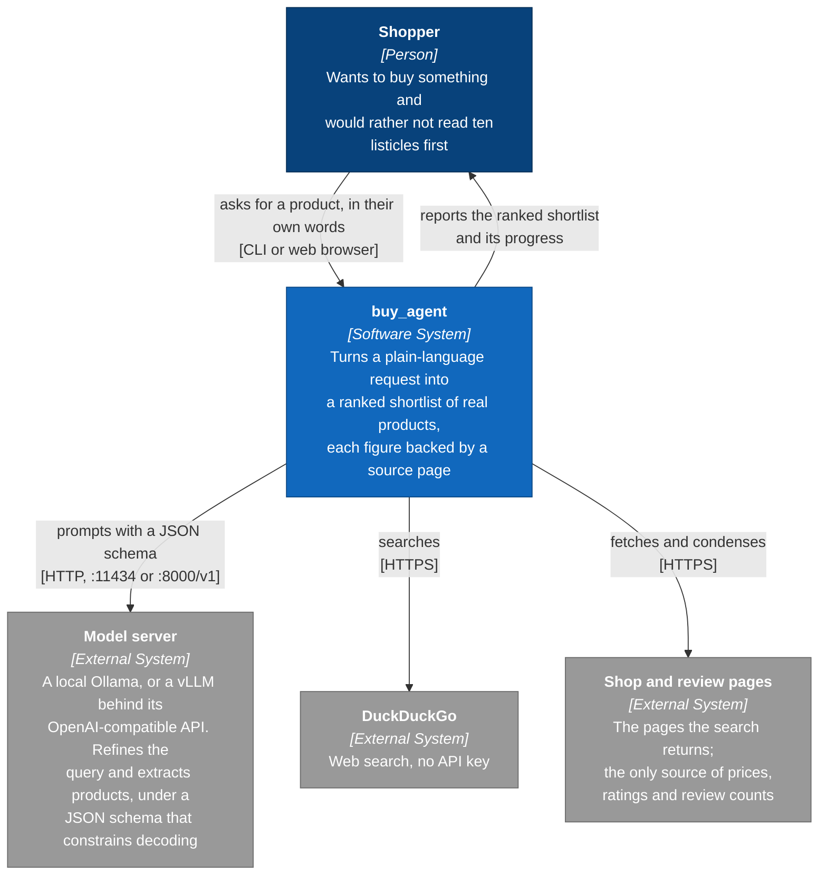
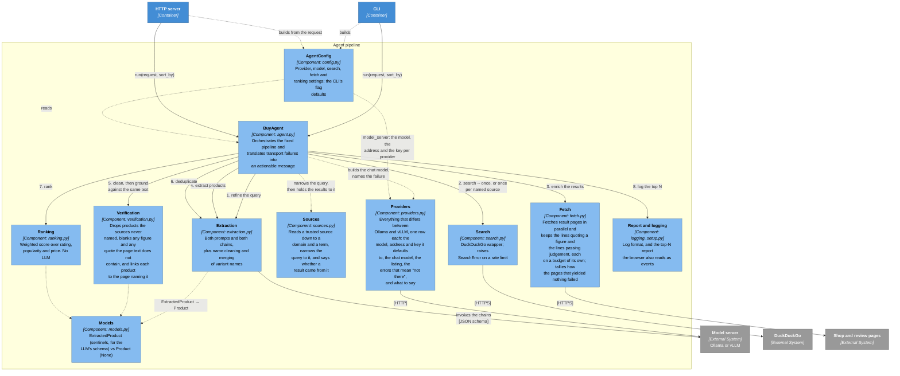
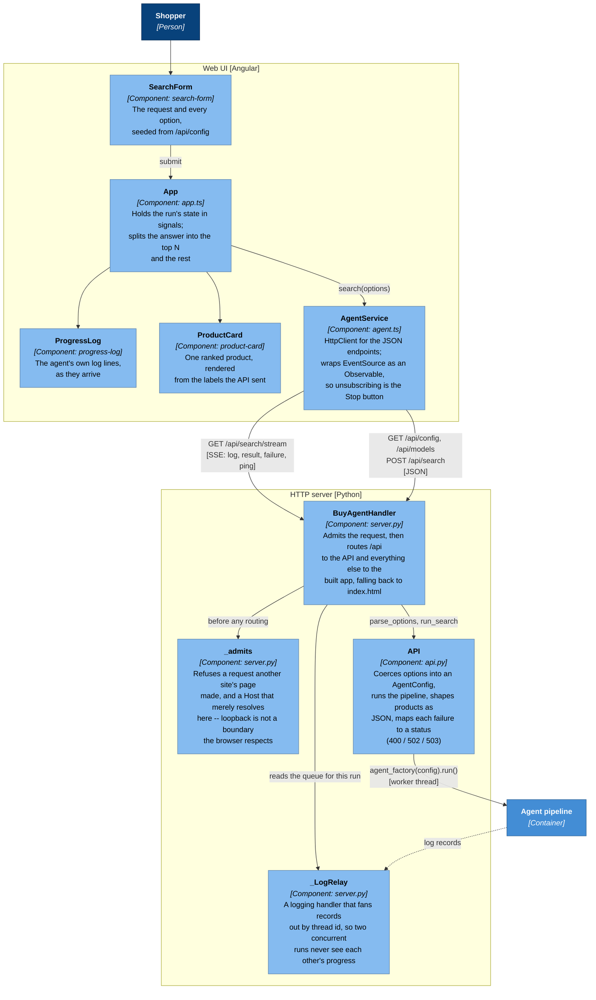
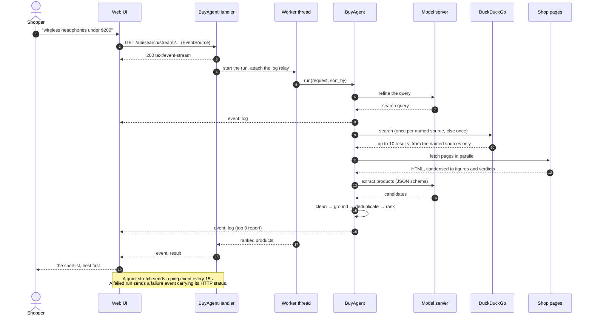

# Architecture (C4)

The [C4 model](https://c4model.com) at three zoom levels: who uses the system,
what it is made of, and how the pieces inside each part fit together. The
diagrams are Mermaid, so GitHub renders them in place.

This is what the system *is*. Why it is this way -- and what was tried and
rejected on the way -- is the decision log in [adr/](adr/README.md); the two are
meant to be read together, and a boundary that moves here usually means a new
record there.

The one idea worth carrying through all three levels: **the LLM is not in
charge.** It refines the query and reads products out of pages; every decision
that shapes the answer -- filtering, grounding, ranking, ordering -- is ordinary
Python. That is why the component diagram has one small box for the model and
several for the code around it.

## Level 1 -- System context

Everything runs on the shopper's own machine, or on one they control: no
accounts, no hosted models, and nothing about a search leaves except the search
itself and the page fetches. Which model server that is -- Ollama by default, or
a vLLM already serving a model on a GPU box -- is `AgentConfig.provider`, and
nothing downstream of `buy_agent/providers.py` knows the difference: one table
row holds a server whole, and `AgentConfig.model_server` is the only place a
provider name becomes behaviour
([ADR-0028](adr/0028-serve-the-model-from-ollama-or-vllm.md),
[ADR-0029](adr/0029-one-table-per-model-server.md)).

## Level 2 -- Containers

The CLI and the server are two front ends onto the same `BuyAgent.run()`. The
server is stdlib-only on purpose -- a run that takes a minute and serves one
person does not need a framework under it. It binds loopback, which keeps it off
the network but not out of the browser: every request is admitted before it is
routed, so the API answers its own page and not the other tabs
([ADR-0018](adr/0018-guard-the-loopback-server-against-other-pages.md)).

The three containers inside the box ship as one image when the `Dockerfile` is
used: the UI is built in a Node stage and copied into the Python one, and the
same image runs either front end. The model server stays outside it, on the host
or on another machine, for the reasons in
[ADR-0015](adr/0015-package-the-web-tier-as-a-container.md) -- the boundary drawn
here is the one the image keeps, and it is the same boundary whichever of the two
is answering.

## Level 3 -- Components of the agent pipeline

Two joints in that order are load-bearing, and both are about not ranking a
number nobody wrote down:

- `clean_products` runs **before** `ground`, so a name still wearing its
  publisher suffix ("... Review | AudioSite") is not failed by a coverage check
  for tokens the page never had to contain.
- `ground` runs **before** `deduplicate`, so merging only ever combines figures
  -- and links -- the sources back.

Order alone is not enough for the merge, because a merge also *pairs* figures.
`models.QUALIFIERS` names what only qualifies another field -- price with
currency, rating with review count -- and `_fill_gaps` moves whole groups,
so a listing that quoted 129 and one that quoted "249 EUR" are never reported
together as "129.00 EUR" (ADR-0022).

Extraction and verification must be handed the *same* text, which is why
`fetch.enrich()` puts the condensed page content on `SearchResult` rather than
passing it alongside.

Step 3 also says how it went, because grounding downstream blanks every figure
the pages did not back: a run whose fetches all failed reports "price unknown"
for everything, which reads as a bad model rather than as nothing having been
read. So the tally names the *kinds* of failure and counts them -- "Got usable
page text from 0 of 10 result(s): 7 refused (403), 2 timed out, 1 quoted no
prices and no verdicts" -- one line at INFO, which is what the browser's progress
panel relays, with the per-URL reasons left at DEBUG where they were. Nothing
read at all is a warning rather than another step of the narration.

Step 2 is one search, unless the shopper named the sources the facts should come
from -- `site:` takes one domain at a time, so each source is searched for
separately and the results pooled, deduplicated by URL and cut back to the width
the run was configured for. `sources.py` decides only what a source *is*; the
searching stays in `agent.py` and the DuckDuckGo call stays in `search.py`
(ADR-0021). Nothing further down knows the feature exists: the pool is what gets
fetched, extracted from and grounded against either way, which is what makes
"every fact came from a page you named" true by construction rather than by
promise (ADR-0027).

Grounding covers the quoted opinions too, and holds them to a stricter bar
than a figure, in two ways. A quote has to appear as running text -- overlapping
runs of five consecutive words, most of which must be found -- rather than as
words that each occur somewhere, because a model paraphrasing out of the
vocabulary it has just read would clear any looser bar, and what it produces is
words in a reviewer's mouth (ADR-0024). And it has to appear on a *single page
that mentions the product*, rather than anywhere in the ten pooled together,
because a real verdict on the electric kettle three results down is not evidence
about these headphones (ADR-0025). The merge treats opinions as the exception
they are: they come from *both* listings, since two reviewers, unlike two prices,
are not in conflict.

Grounding also decides where a product *links*. The model is asked for a `url`
but reliably leaves it empty, so `attribute_sources()` gives each product the
first searched page whose own text mentions it, and keeps a model-supplied link
only when it names one of those pages (ADR-0017).

## Level 3 -- Components of the web tier

Four details there are easy to get wrong and are deliberate:

- **A run is streamed, not requested.** A search takes tens of seconds, so the
  UI uses `GET /api/search/stream` and watches the same progress the CLI prints.
  `POST /api/search` is the same run in one response, for scripts.
- **The stream's failure event is called `failure`, not `error`.** A browser's
  `EventSource` delivers transport errors under `error` and then reconnects; a
  named `error` event would be indistinguishable from a dropped connection, and
  the reconnect would silently start the whole search again.
- **The browser decides nothing.** Ranking, grounding and even the wording of an
  unknown price stay in Python: `product_payload` sends `price_label` and
  `rating_label` next to the raw figures, and `sort_by` is a request parameter
  rather than a client-side re-sort.
- **Loopback is not a boundary the browser respects.** Any page the shopper has
  open can reach `127.0.0.1`, so `_admits` runs before routing and refuses a
  request another site's page made -- which would otherwise start a run whose
  answer it could never read -- and a `Host` that merely resolves here, which is
  how such a page would arrange to read one (ADR-0018).

## A streamed run, end to end

Only query refinement is recoverable: it falls back to the raw request, but lets
`ModelUnavailableError` through rather than searching with a model that is not
there. `BuyAgent.run()` raises exactly three things -- `ValueError`,
`ModelUnavailableError`, `SearchError` -- which `__main__.main()` logs and
`api._STATUS` maps onto 400, 503 and 502. Which sentence that middle one carries
-- `ollama pull` or `vllm serve` -- is the provider's to write, and is the whole
value of the exception.
