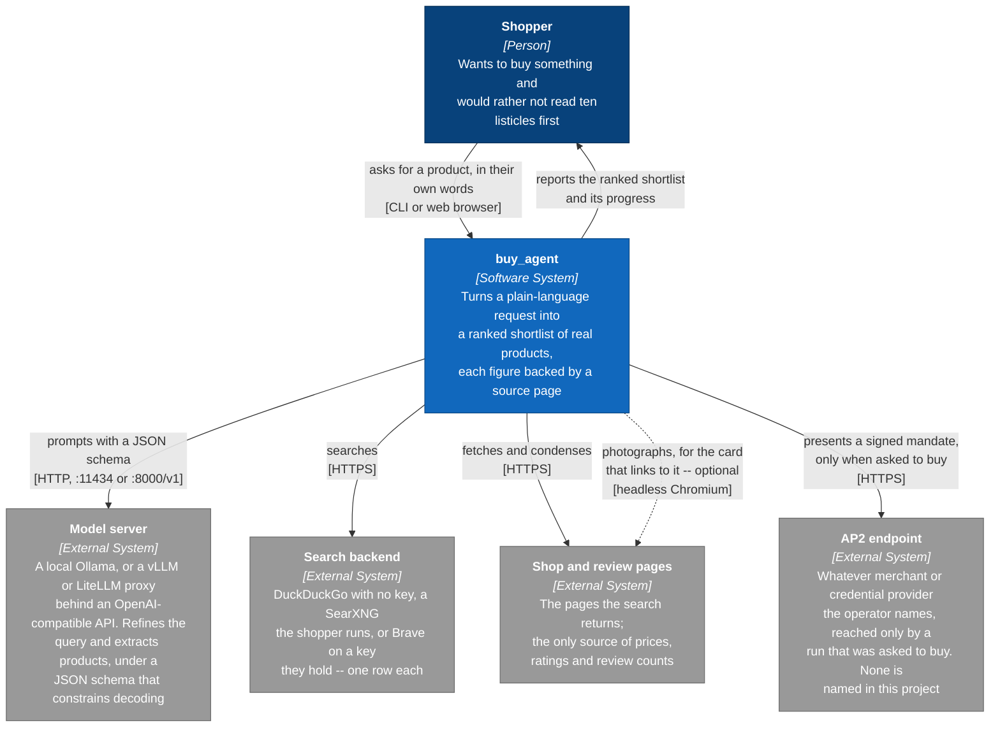
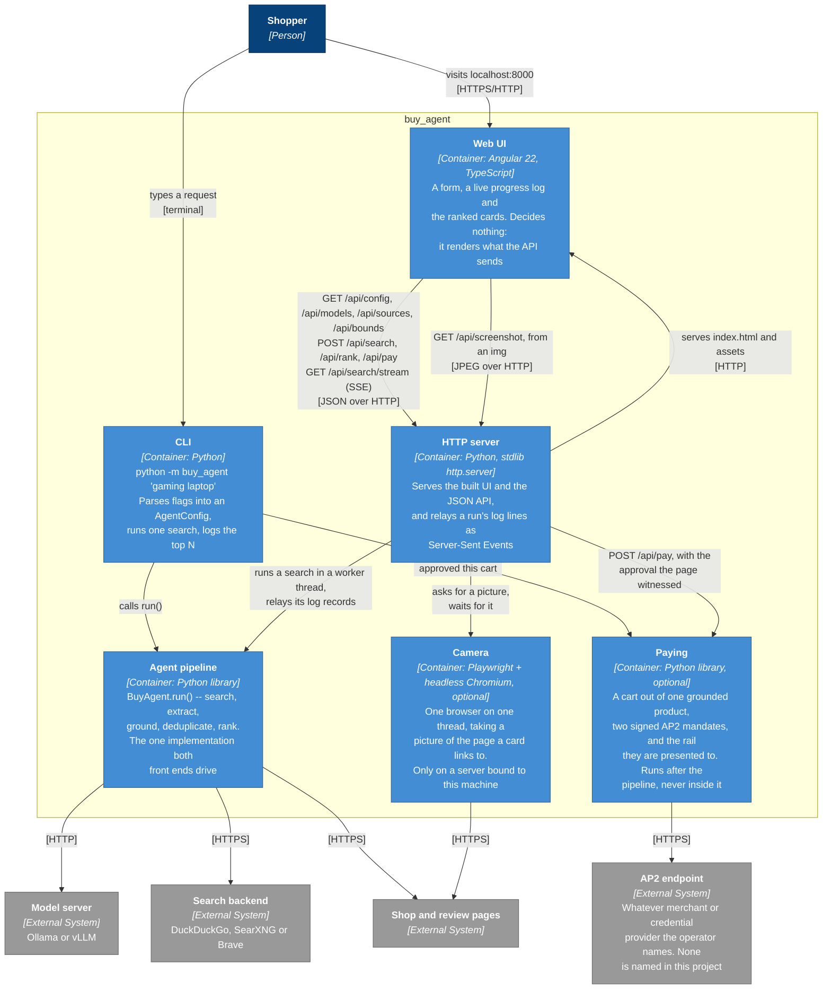
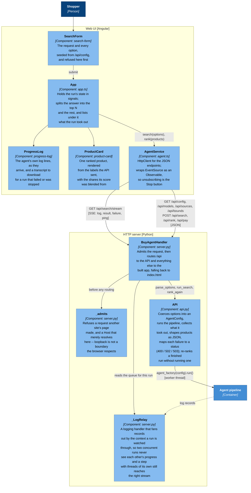
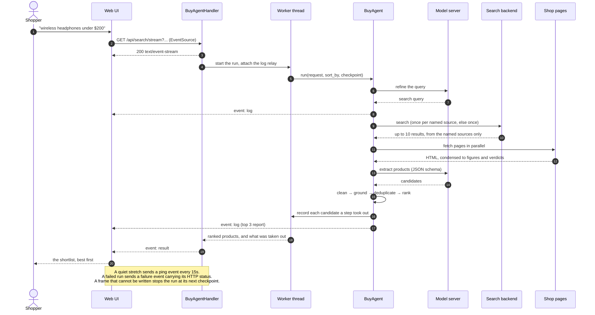

# Architecture (C4)

The [C4 model](https://c4model.com) at three zoom levels, in Mermaid so GitHub
renders it. Why it is this way is in [adr/](adr/README.md). The idea through all
three levels: **the LLM is not in charge.** It refines the query and reads
products out of pages; filtering, grounding, ranking and ordering are Python.

## Level 1 -- System context

```mermaid
graph TB
    shopper["<b>Shopper</b><br/><i>[Person]</i><br/>Wants to buy something and<br/>would rather not read ten<br/>listicles first"]

    system["<b>buy_agent</b><br/><i>[Software System]</i><br/>Turns a plain-language request into<br/>a ranked shortlist of real products,<br/>each figure backed by a source page"]

    ollama["<b>Model server</b><br/><i>[External System]</i><br/>A local Ollama, or a vLLM or LiteLLM proxy<br/>behind an OpenAI-compatible API. Refines the<br/>query and extracts products, under a<br/>JSON schema that constrains decoding"]
    ddg["<b>Search backend</b><br/><i>[External System]</i><br/>DuckDuckGo with no key, a SearXNG<br/>the shopper runs, or Brave on a key<br/>they hold -- one row each"]
    shops["<b>Shop and review pages</b><br/><i>[External System]</i><br/>The pages the search returns;<br/>the only source of prices,<br/>ratings and review counts"]
    counterparty["<b>AP2 endpoint</b><br/><i>[External System]</i><br/>Whatever merchant or credential provider<br/>the operator names, reached only by a<br/>run that was asked to buy. None is<br/>named in this project"]

    shopper -->|"asks for a product, in their own words<br/>[CLI or web browser]"| system
    system -->|"reports the ranked shortlist<br/>and its progress"| shopper
    system -->|"prompts with a JSON schema<br/>[HTTP, :11434 or :8000/v1]"| ollama
    system -->|"searches<br/>[HTTPS]"| ddg
    system -->|"fetches and condenses<br/>[HTTPS]"| shops
    system -.->|"photographs, for the card<br/>that links to it -- optional<br/>[headless Chromium]"| shops
    system -->|"presents a signed mandate,<br/>only when asked to buy<br/>[HTTPS]"| counterparty

    classDef person fill:#08427b,stroke:#052e56,color:#fff
    classDef internal fill:#1168bd,stroke:#0b4884,color:#fff
    classDef external fill:#999,stroke:#6b6b6b,color:#fff
    class shopper person
    class system internal
    class ollama,ddg,shops,counterparty external
```

Everything runs on machines the shopper controls. Only the search and the page
fetches leave, plus a second visit by the camera where a loopback server takes
pictures ([ADR-0065](adr/0065-photograph-each-products-page-from-a-server-bound-to-this-machine.md)),
and a signed AP2 mandate where a run was asked to buy; the default rail charges
nobody ([ADR-0046](adr/0046-pay-on-the-shoppers-behalf-with-ap2.md)). Which
model server answers is `AgentConfig.provider`, and only `buy_agent/providers.py`
knows the difference
([ADR-0028](adr/0028-serve-the-model-from-ollama-or-vllm.md),
[ADR-0029](adr/0029-one-table-per-model-server.md),
[ADR-0068](adr/0068-reach-a-litellm-proxy-as-a-third-model-server.md)).

## Level 2 -- Containers

```mermaid
graph TB
    shopper["<b>Shopper</b><br/><i>[Person]</i>"]

    subgraph system["buy_agent"]
        cli["<b>CLI</b><br/><i>[Container: Python]</i><br/>python -m buy_agent 'gaming laptop'<br/>Parses flags into an AgentConfig,<br/>runs one search, logs the top N"]
        spa["<b>Web UI</b><br/><i>[Container: Angular 22, TypeScript]</i><br/>A form, a live progress log and<br/>the ranked cards. Decides nothing:<br/>it renders what the API sends"]
        server["<b>HTTP server</b><br/><i>[Container: Python, stdlib http.server]</i><br/>Serves the built UI and the JSON API,<br/>and relays a run's log lines as<br/>Server-Sent Events"]
        pipeline["<b>Agent pipeline</b><br/><i>[Container: Python library]</i><br/>BuyAgent.run() -- search, extract,<br/>ground, deduplicate, rank.<br/>The one implementation both<br/>front ends drive"]
        paying["<b>Paying</b><br/><i>[Container: Python library, optional]</i><br/>A cart out of one grounded product,<br/>two signed AP2 mandates, and the rail<br/>they are presented to. Runs after the<br/>pipeline, never inside it"]
        camera["<b>Camera</b><br/><i>[Container: Playwright + headless Chromium, optional]</i><br/>One browser on one thread, taking a<br/>picture of the page a card links to.<br/>Only on a server bound to this machine"]
    end

    ollama["<b>Model server</b><br/><i>[External System]</i><br/>Ollama or vLLM"]
    ddg["<b>Search backend</b><br/><i>[External System]</i><br/>DuckDuckGo, SearXNG or Brave"]
    shops["<b>Shop and review pages</b><br/><i>[External System]</i>"]
    counterparty["<b>AP2 endpoint</b><br/><i>[External System]</i><br/>Whatever merchant or credential<br/>provider the operator names. None<br/>is named in this project"]

    shopper -->|"types a request<br/>[terminal]"| cli
    shopper -->|"visits localhost:8000<br/>[HTTPS/HTTP]"| spa

    spa -->|"GET /api/config, /api/models, /api/sources, /api/bounds<br/>POST /api/search, /api/rank, /api/pay<br/>GET /api/search/stream (SSE)<br/>[JSON over HTTP]"| server
    spa -->|"GET /api/screenshot, from an img<br/>[JPEG over HTTP]"| server
    server -->|"serves index.html and assets<br/>[HTTP]"| spa
    cli -->|"calls run()"| pipeline
    server -->|"runs a search in a worker thread,<br/>relays its log records"| pipeline

    cli -->|"pays, once a person<br/>approved this cart"| paying
    server -->|"POST /api/pay, with the<br/>approval the page witnessed"| paying
    server -->|"asks for a picture,<br/>waits for it"| camera

    pipeline -->|"[HTTP]"| ollama
    pipeline -->|"[HTTPS]"| ddg
    pipeline -->|"[HTTPS]"| shops
    paying -->|"[HTTPS]"| counterparty
    camera -->|"[HTTPS]"| shops

    classDef person fill:#08427b,stroke:#052e56,color:#fff
    classDef container fill:#438dd5,stroke:#2e6295,color:#fff
    classDef external fill:#999,stroke:#6b6b6b,color:#fff
    class shopper person
    class cli,spa,server,pipeline,paying,camera container
    class ollama,ddg,shops,counterparty external
```

The CLI and the server are two front ends onto one `BuyAgent.run()`. The server
is stdlib-only and admits every request before routing it, so the API answers
its own page and not other tabs
([ADR-0018](adr/0018-guard-the-loopback-server-against-other-pages.md)).

Paying is its own container: both front ends reach it, it reaches nothing back,
and it settles afterwards from a product the run already grounded
([ADR-0046](adr/0046-pay-on-the-shoppers-behalf-with-ap2.md)). The camera is
further out still: the pipeline never knows it exists, and it is the one part
that starts a process, so only a loopback server has one
([ADR-0065](adr/0065-photograph-each-products-page-from-a-server-bound-to-this-machine.md)).

The `Dockerfile` ships the containers as one image, without the AP2 SDK or the
camera. The model server stays outside it
([ADR-0015](adr/0015-package-the-web-tier-as-a-container.md)).

## Level 3 -- Components of the agent pipeline

```mermaid
graph TB
    cli["<b>CLI</b><br/><i>[Container]</i>"]
    server["<b>HTTP server</b><br/><i>[Container]</i>"]

    subgraph pipeline["Agent pipeline"]
        agent["<b>BuyAgent</b><br/><i>[Component: agent.py]</i><br/>Orchestrates the fixed pipeline,<br/>hands each step the checkpoint, the<br/>wait and the recorder, and translates<br/>transport failures into an<br/>actionable message"]
        config["<b>AgentConfig</b><br/><i>[Component: config.py]</i><br/>Provider, model, search, fetch and<br/>ranking settings; the CLI's flag<br/>defaults, and the ranges and the<br/>region shape both front doors<br/>hold a request to"]
        providers["<b>Providers</b><br/><i>[Component: providers.py]</i><br/>Everything that differs between<br/>Ollama and vLLM, one row each: the<br/>model, address and key it defaults<br/>to, the client and how it declares a<br/>schema, the listing, which of the two<br/>settings it takes rather than fixing<br/>at startup, the errors that mean<br/>&quot;not there&quot;, and what to say"]
        chat["<b>Chat</b><br/><i>[Component: chat.py]</i><br/>A prompt with the run's values in it,<br/>a chain binding one to a schema, and<br/>the answer read back as that schema<br/>-- or refused"]
        extraction["<b>Extraction</b><br/><i>[Component: extraction.py]</i><br/>Both prompts and both chains,<br/>plus name cleaning and merging<br/>of variant names"]
        search["<b>Search</b><br/><i>[Component: search.py]</i><br/>Which backend a search is asked<br/>through, one row each: where it<br/>listens, its key, how it is asked and<br/>what it answers. Asks once more where<br/>the backend failed, and raises<br/>SearchError when that one does too"]
        sources["<b>Sources</b><br/><i>[Component: sources.py]</i><br/>Reads a trusted source down to a<br/>domain and a term, narrows the<br/>query to it, and says whether a<br/>result came from it"]
        fetch["<b>Fetch</b><br/><i>[Component: fetch.py]</i><br/>Fetches result pages in parallel and<br/>keeps the lines quoting a figure and<br/>the lines passing judgement, each<br/>on a budget of its own; asks a page<br/>that said to come back once more;<br/>tallies how the rest failed"]
        cache["<b>Cache</b><br/><i>[Component: cache.py]</i><br/>What a run can reuse: the text of a<br/>fetched page, and the answer a model<br/>gave about it. Kept on disk for a<br/>day, and bounded by size as well as<br/>age. Best-effort: every failure is a<br/>miss, never a failed run"]
        journal["<b>Journal</b><br/><i>[Component: journal.py]</i><br/>What past runs of this same search<br/>reported -- a name, a price and a<br/>currency each -- so this one can say<br/>what is cheaper, dearer, new or<br/>gone. Bounded by a count and never<br/>by an age, and one setting off"]
        boundsc["<b>Noticed bounds</b><br/><i>[Component: bounds.py]</i><br/>Reads &quot;under $200&quot; out of the<br/>request in ordinary Python, and<br/>answers the figure and the words it<br/>read. Offered at both doors and<br/>applied at neither"]
        verification["<b>Verification</b><br/><i>[Component: verification.py]</i><br/>Drops products the sources never<br/>named, blanks any figure and any<br/>quote the page text does not<br/>contain, and links each product --<br/>and each quote -- to the page it<br/>came off"]
        constraints["<b>Constraints</b><br/><i>[Component: constraints.py]</i><br/>The shopper's bounds -- max price,<br/>min rating, min reviews -- applied<br/>after merging and before ranking.<br/>An unknown figure is not a violation"]
        ranking["<b>Ranking</b><br/><i>[Component: ranking.py]</i><br/>Weighted score over rating,<br/>popularity and price -- prices<br/>compared inside one currency -- and<br/>the shares it was blended from. No LLM"]
        models["<b>Models</b><br/><i>[Component: models.py]</i><br/>ExtractedProduct (sentinels, for the<br/>LLM's schema) vs Product (None), the<br/>Offer each page priced it at, and the<br/>Removal a step hands over when it<br/>takes a candidate out"]
        moneyc["<b>Money</b><br/><i>[Component: money.py]</i><br/>Every currency table: which<br/>spellings are one currency, which<br/>ones a page is scanned for, how an<br/>amount is written and how many<br/>minor units it comes to"]
        logsetup["<b>Report and logging</b><br/><i>[Component: logging_setup.py]</i><br/>Log format, and the top-N report<br/>the browser also reads as events"]
    end

    subgraph paying["Paying -- optional, off, and after the run"]
        payment["<b>Payment</b><br/><i>[Component: payment.py]</i><br/>What may be bought and for how<br/>much: a cart out of a grounded<br/>product, the spend limit, and the<br/>receipt. One failure, PaymentError"]
        mandatesc["<b>Mandates</b><br/><i>[Component: mandates.py]</i><br/>The only module that imports the<br/>AP2 SDK. Signs the Checkout and<br/>Payment Mandates, bound to the<br/>merchant&#39;s signed checkout by hash,<br/>and checks an open mandate&#39;s<br/>constraints"]
        railsc["<b>Rails</b><br/><i>[Component: rails.py]</i><br/>Who the payment goes through, one<br/>row each: where it listens, whether<br/>it needs an address and an enrolled<br/>key, whether it moves money, and<br/>what to say when it cannot be<br/>reached"]
    end

    ollama["<b>Model server</b><br/><i>[External System]</i><br/>Ollama or vLLM"]
    ddg["<b>Search backend</b><br/><i>[External System]</i><br/>DuckDuckGo, SearXNG or Brave"]
    shops["<b>Shop and review pages</b><br/><i>[External System]</i>"]
    counterparty["<b>AP2 endpoint</b><br/><i>[External System]</i><br/>Whatever merchant or credential<br/>provider the operator names. None<br/>is named in this project"]

    cli -->|"run(request, sort_by)"| agent
    server -->|"run(request, sort_by)"| agent
    cli -.->|"builds"| config
    server -.->|"builds from the request"| config
    config -.->|"reads"| agent

    extraction -.->|"a prompt, a schema,<br/>one answer"| chat
    chat -.->|"asks the server the<br/>provider built"| providers

    agent -->|"1. refine the query"| extraction
    agent -->|"2. search -- once, or once<br/>per named source"| search
    agent -.->|"narrows the query,<br/>then holds the results to it"| sources
    agent -->|"3. enrich the results"| fetch
    agent -->|"4. extract products"| extraction
    agent -->|"5. clean, then ground<br/>against the same text"| verification
    agent -->|"6. deduplicate"| extraction
    agent -->|"7. hold to the<br/>shopper's bounds"| constraints
    agent -->|"8. rank"| ranking
    agent -->|"9. log the top N"| logsetup
    agent -.->|"builds the chat model,<br/>names the failure"| providers
    config -.->|"model_server: the model, the<br/>address and the key per provider"| providers
    config -.->|"search_backend: which row<br/>a search is asked through"| search

    providers -->|"[HTTP]"| ollama
    extraction -->|"invokes the chains<br/>[JSON schema]"| ollama
    search -->|"[HTTPS]"| ddg
    fetch -->|"[HTTPS]"| shops
    cli -->|"10. pay, once a person<br/>approved this cart"| payment
    server -->|"POST /api/pay, with the<br/>approval the page witnessed"| payment
    payment -.->|"signs the two mandates"| mandatesc
    payment -.->|"config.rail_used: the<br/>checkout, then the settlement"| railsc
    railsc -.->|"signs its own checkout<br/>on the dry run"| mandatesc
    railsc -->|"[HTTPS]"| counterparty
    payment -.->|"only a grounded price<br/>may be paid"| models
    config -.->|"rail_used: where a payment<br/>goes and what it needs"| railsc
    fetch -.->|"reads what it read<br/>last time"| cache
    agent -.->|"reuses what the model<br/>answered last time"| cache
    cli -.->|"offers what the request<br/>asked for in words"| boundsc
    server -.->|"GET /api/bounds, which<br/>runs nothing"| boundsc
    cli -.->|"writes this run down, then<br/>says what moved"| journal
    server -.->|"the same, beside the<br/>products it answers with"| journal
    agent -.->|"keys a journal by what<br/>was asked, not how"| journal
    extraction -.->|"ExtractedProduct → Product;<br/>a Removal per headline,<br/>fold and nameless entry"| models
    verification -.->|"a Removal per product<br/>no page named"| models
    constraints -.->|"a Removal per product<br/>the bounds would not have"| models
    ranking -.-> models
    models -.->|"places the spelling a<br/>listing named"| moneyc
    fetch -.->|"scans for the spellings it<br/>can place"| moneyc
    payment -.->|"counts the cart in<br/>minor units"| moneyc

    classDef container fill:#438dd5,stroke:#2e6295,color:#fff
    classDef component fill:#85bbf0,stroke:#5d82a8,color:#000
    classDef external fill:#999,stroke:#6b6b6b,color:#fff
    class cli,server container
    class agent,config,providers,extraction,search,sources,fetch,cache,journal,boundsc,verification,constraints,ranking,models,moneyc,logsetup component
    class payment,mandatesc,railsc component
    class ollama,ddg,shops,counterparty external
```

Three joints in that order are load-bearing:

- `clean_products` runs **before** `ground`, so a name wearing its publisher
  suffix ("... Review | AudioSite") does not fail the name check.
- `ground` runs **before** `deduplicate`, so merging only combines figures and
  links the sources back.
- The bounds run **after** `deduplicate`, which may supply the price, and
  **before** `rank_products`, since price scores relative to the set (ADR-0039).

Step 10 is outside that order: `BuyAgent.run` ends at the report, and paying
happens afterwards to one product a person or an open mandate approved. A price
no source printed, or in a currency the run cannot place, is never paid -- the
opposite of the bounds, which keep what they cannot judge (ADR-0046).

A merge also *pairs* figures: `models.QUALIFIERS` ties currency to price and
review count to rating, and `_fill_gaps` moves whole groups (ADR-0022).
Extraction and verification must see the same text, which is why
`fetch.enrich()` puts it on `SearchResult`.

- **Step 2** is one search, or one per named source, pooled, deduplicated by URL
  and cut back to width. `sources.py` decides what a source is; nothing
  downstream knows the feature exists (ADR-0021, ADR-0027, ADR-0057).
- **Step 3** tallies how fetching failed ("7 refused (403), 2 timed out") at
  INFO, since a run that read nothing otherwise looks like a bad model.
- **Step 5** holds quotes to a stricter bar than figures: most overlapping
  five-word runs must be found, on one page that mentions the product
  (ADR-0024, ADR-0025), and that page is kept on the quote (ADR-0042). It also
  links each product to the first searched page mentioning it (ADR-0017).
- **Step 7** enforces the shopper's bounds. Unknown figures pass, and so do
  prices outside the run's one currency, which is never converted (ADR-0039,
  ADR-0043, ADR-0056).
- **Step 8** keeps the shares a score was blended from, so an assumed 0.5 is
  told from a measured one (ADR-0041).

The five heuristics that take a whole candidate out (`clean_products`,
`drop_ungrounded`, `merge_variants`, `deduplicate`'s nameless drop and
`Constraints.apply`) also call `record` with a `models.Removal`, whose sentence
nothing downstream rewords. It defaults to `models.nothing_recorded`. Steps that
only blank something record nothing (ADR-0055).

## Level 3 -- Components of the web tier

```mermaid
graph TB
    browserUser["<b>Shopper</b><br/><i>[Person]</i>"]

    subgraph spa["Web UI [Angular]"]
        app["<b>App</b><br/><i>[Component: app.ts]</i><br/>Holds the run's state in signals;<br/>splits the answer into the top N<br/>and the rest, and lists under it<br/>what the run took out"]
        form["<b>SearchForm</b><br/><i>[Component: search-form]</i><br/>The request and every option,<br/>seeded from /api/config,<br/>and refused here first"]
        log["<b>ProgressLog</b><br/><i>[Component: progress-log]</i><br/>The agent's own log lines, as they<br/>arrive, and a transcript to download<br/>for a run that failed or was stopped"]
        card["<b>ProductCard</b><br/><i>[Component: product-card]</i><br/>One ranked product, rendered<br/>from the labels the API sent,<br/>with the shares its score<br/>was blended from"]
        agentsvc["<b>AgentService</b><br/><i>[Component: agent.ts]</i><br/>HttpClient for the JSON endpoints;<br/>wraps EventSource as an Observable,<br/>so unsubscribing is the Stop button"]
    end

    subgraph srv["HTTP server [Python]"]
        handler["<b>BuyAgentHandler</b><br/><i>[Component: server.py]</i><br/>Admits the request, then routes /api<br/>to the API and everything else to the<br/>built app, falling back to index.html"]
        guard["<b>_admits</b><br/><i>[Component: server.py]</i><br/>Refuses a request another site's page<br/>made, and a Host that merely resolves<br/>here -- loopback is not a boundary<br/>the browser respects"]
        relay["<b>_LogRelay</b><br/><i>[Component: server.py]</i><br/>A logging handler that fans records<br/>out by the context a run is watched<br/>through, so two concurrent runs never<br/>see each other's progress and a step<br/>with threads of its own still reaches<br/>the right stream"]
        api["<b>API</b><br/><i>[Component: api.py]</i><br/>Coerces options into an AgentConfig,<br/>runs the pipeline, collects what it<br/>took out, shapes products as JSON,<br/>maps each failure to a status<br/>(400 / 502 / 503); re-ranks a finished<br/>run without running one"]
    end

    agentpipeline["<b>Agent pipeline</b><br/><i>[Container]</i>"]

    browserUser --> form
    form -->|"submit"| app
    app --> log
    app --> card
    app -->|"search(options), rank(products)"| agentsvc
    agentsvc -->|"GET /api/search/stream<br/>[SSE: log, result, failure, ping]"| handler
    agentsvc -->|"GET /api/config, /api/models, /api/sources, /api/bounds<br/>POST /api/search, /api/rank, /api/pay<br/>[JSON]"| handler

    handler -->|"before any routing"| guard
    handler -->|"parse_options, run_search, rank_again"| api
    handler -->|"reads the queue for this run"| relay
    api -->|"agent_factory(config).run()<br/>[worker thread]"| agentpipeline
    agentpipeline -.->|"log records"| relay

    classDef person fill:#08427b,stroke:#052e56,color:#fff
    classDef container fill:#438dd5,stroke:#2e6295,color:#fff
    classDef component fill:#85bbf0,stroke:#5d82a8,color:#000
    class browserUser person
    class agentpipeline container
    class app,form,log,card,agentsvc,handler,guard,relay,api component
```

Deliberate details:

- **A run is streamed.** The UI uses `GET /api/search/stream`; `POST
  /api/search` is the same run in one response, for scripts.
- **Re-ordering and paying run nothing.** `POST /api/rank` calls only
  `rank_products` on the products and currency the page holds (ADR-0035,
  ADR-0056). `POST /api/pay` builds the cart on the server, and the page's echo
  of title, price and currency must match it (ADR-0012, ADR-0046).
- **Closing the stream stops the run at its next `checkpoint`.** A chat call in
  flight still finishes (ADR-0034).
- **The failure event is `failure`, not `error`**, because `EventSource`
  reconnects on `error` and would start the search again.
- **`dropped` travels with the result** and survives a re-sort (ADR-0055).
- **The browser decides nothing.** Labels such as `price_label` are Python's,
  and `sort_by` is a request even for a finished run.
- **Loopback is not a boundary the browser respects**, so `_admits` refuses
  cross-site requests and foreign `Host`s before routing (ADR-0018).

## A streamed run, end to end

```mermaid
sequenceDiagram
    autonumber
    actor S as Shopper
    participant UI as Web UI
    participant H as BuyAgentHandler
    participant W as Worker thread
    participant A as BuyAgent
    participant O as Model server
    participant D as Search backend
    participant P as Shop pages

    S->>UI: "wireless headphones under $200"
    UI->>H: GET /api/search/stream?... (EventSource)
    H-->>UI: 200 text/event-stream
    H->>W: start the run, attach the log relay
    W->>A: run(request, sort_by, checkpoint)
    A->>O: refine the query
    O-->>A: search query
    A-->>UI: event: log
    A->>D: search (once per named source, else once)
    D-->>A: up to 10 results, from the named sources only
    A->>P: fetch pages in parallel
    P-->>A: HTML, condensed to figures and verdicts
    A->>O: extract products (JSON schema)
    O-->>A: candidates
    A->>A: clean → ground → deduplicate → rank
    A->>W: record each candidate a step took out
    A-->>UI: event: log (top 3 report)
    W-->>H: ranked products, and what was taken out
    H-->>UI: event: result
    UI-->>S: the shortlist, best first
    Note over H,UI: A quiet stretch sends a ping event every 15s.<br/>A failed run sends a failure event carrying its HTTP status.<br/>A frame that cannot be written stops the run at its next checkpoint.
```

Only query refinement is recoverable: it falls back to the raw request but lets
`ModelUnavailableError` through. `BuyAgent.run()` raises exactly `ValueError`,
`ModelUnavailableError` and `SearchError`, which `api._STATUS` maps to 400, 503
and 502; the provider writes the remedy the middle one carries.
